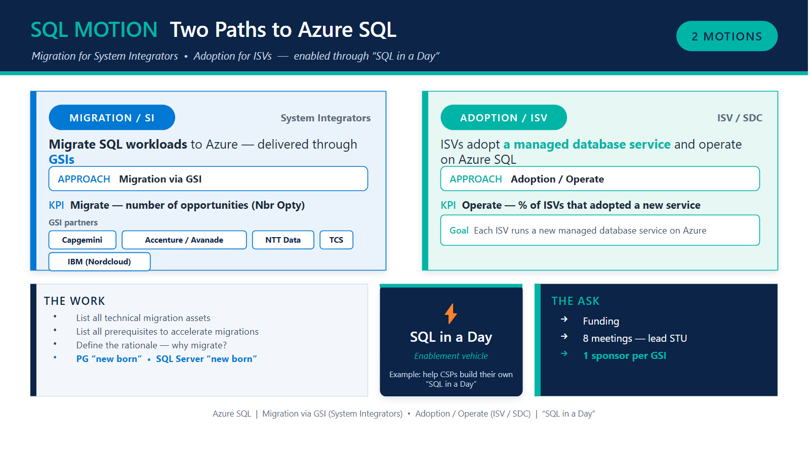
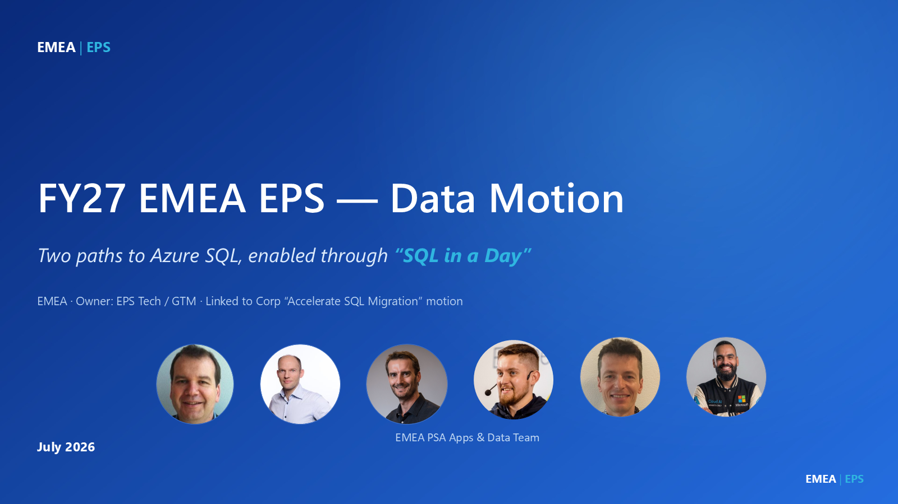

# FY27 SQL Motion

This repo is the **SQL motion** for FY27. It follows the shared motion template:
a README with the strategy, a one-slide executive summary, supporting docs, build
scripts, and the bundled slide generator.

---

## 🎯 What we want to do

Drive **Azure SQL** through **two complementary go-to-market paths**, enabled by a
single hands-on vehicle — **"SQL in a Day"**.

| Path | Audience | Approach | KPI |
| ---- | -------- | -------- | --- |
| **Migration** | System Integrators (GSIs) | Migrate SQL workloads to Azure, delivered through GSIs | **Migrate** — number of opportunities (Nbr Opty) |
| **Adoption** | ISV / SDC | ISVs adopt a managed database service and operate on Azure SQL | **Operate** — % of ISVs that adopted a new service |

**Enablement vehicle:** ⚡ *SQL in a Day* — e.g. help CSPs build their own
"SQL in a Day".

**The work**
- List all technical migration assets.
- List all prerequisites to accelerate migrations.
- Define the rationale — *why migrate?* (PG "new born" · SQL Server "new born").

**The ask**
- Funding.
- 8 meetings — lead STU.
- 1 sponsor per GSI.

**GSI partners:** Capgemini · Accenture / Avanade · NTT Data · TCS · IBM (Nordcloud).

---

## 🖼️ The one-slide summary



The editable deck is in [`deck/MotionSQL-Azure.pptx`](deck/MotionSQL-Azure.pptx).
It is generated from a small JSON config ([`deck/motion-sql.json`](deck/motion-sql.json)),
so the slide is **reproducible** and **version-controlled** — change the config,
regenerate, and the slide stays consistent.

---

## 🎞️ The full motion deck

[](docs/FY27%20EMEA%20EPS%20-%20Data%20Motion%20-%20SQL%20in%20a%20Day.pptx)

📥 **[FY27 EMEA EPS — Data Motion — SQL in a Day.pptx](docs/FY27%20EMEA%20EPS%20-%20Data%20Motion%20-%20SQL%20in%20a%20Day.pptx)** *(15 editable slides, click the cover above to download)*

Where the one-slide summary is the elevator pitch, this **15-slide deck** is the full
v-team / leadership story behind the motion. It opens with an **Executive Summary**
("one motion, two execution paths, one repeatable vehicle — *SQL in a Day*") and a
**Motion at a Glance** view — **"We build it, the partner repeats it."**

It then walks both paths end to end:

- **Path A — SI Migration (GSI / Capgemini):** enable GSIs to migrate customer SQL Server
  estates to **Azure SQL** (or **SQL database in Microsoft Fabric** where it fits), led by
  the partner. The differentiator is the afternoon's **AI Migration Agent** — a RAG asset we
  build, run live on the customer's own estate to produce a technical + financial migration
  plan. KPI = **# of migration opportunities created in MSX**.
- **Path B — SDC Adoption (ISV offers):** get every Microsoft-managed ISV to **embed a managed
  data service** (Azure SQL / Azure Database for PostgreSQL) inside their offer, so every
  end-customer mechanically consumes a data workload — growing the SQL Server + PostgreSQL
  footprint by design. KPI = **% of managed ISVs that adopted a managed data service**.

It closes with the strategic "why now" (AI-ready data, SQL Server 2016 End of Support),
the KPI model, the execution roadmap, and **The Ask**.

The condensed narrative is in [`docs/FY27-EPS-Data-Motion-SQL-in-a-Day.md`](docs/FY27-EPS-Data-Motion-SQL-in-a-Day.md).

---

## 🛠️ Regenerate the slide

```bash
# macOS / Linux
./scripts/build.sh
```

```powershell
# Windows
./scripts/build.ps1
```

The scripts install the generator's dependencies, rebuild the `.pptx` from the
config, and (if LibreOffice is available) refresh the PNG preview.

---

## 🧭 Use this repo as a template for a new motion

1. **Create a new repo** from this one (or copy its structure).
2. **Edit the strategy** in this README and `docs/motion-brief.md`.
3. **Edit `deck/motion-sql.json`** (rename it to your motion) with your content.
4. **Run `scripts/build.*`** and commit the `.pptx` + preview PNG.

```
FY27SQLMotion/
├── README.md                     # the motion: vision, paths, KPIs, ask
├── deck/
│   ├── motion-sql.json           # slide content as data (edit this)
│   ├── MotionSQL-Azure.pptx      # generated slide (commit it)
│   └── preview/MotionSQL-Azure.png
├── docs/
│   └── motion-brief.md           # detailed narrative brief
├── scripts/
│   ├── build.sh                  # regenerate slide + preview (macOS/Linux)
│   └── build.ps1                 # regenerate slide + preview (Windows)
└── skill/pptxmotions/            # the generator (see collapsed section below)
```

---

<details>
<summary>🧩 <b>How the slide is generated — the <code>pptxmotions</code> skill</b> (click to expand)</summary>

<br>

The deck is produced by **`pptxmotions`**, a small parametric generator bundled in
[`skill/pptxmotions/`](skill/pptxmotions). It turns the JSON config into a polished
Microsoft Fluent–styled slide, and is also a
[GitHub Copilot CLI](https://docs.github.com/copilot/how-tos/use-copilot-agents/use-copilot-cli)
skill so Copilot can build/update the slide for you on request.

### Regenerate the slide (standalone)

```bash
cd skill/pptxmotions
npm install                       # installs pptxgenjs
node motion.js ../../deck/motion-sql.json ../../deck/MotionSQL-Azure.pptx
```

Render a PNG preview (requires LibreOffice):

```bash
soffice --headless --convert-to png --outdir ../../deck/preview ../../deck/MotionSQL-Azure.pptx
```

### Use it from Copilot CLI

Install the skill once, then just ask Copilot in natural language.

**macOS / Linux**
```bash
git clone https://github.com/fredgis/pptxskill.git ~/.copilot/skills/pptxmotions
cd ~/.copilot/skills/pptxmotions && npm install
```

**Windows (PowerShell)**
```powershell
git clone https://github.com/fredgis/pptxskill.git "$env:USERPROFILE\.copilot\skills\pptxmotions"
cd "$env:USERPROFILE\.copilot\skills\pptxmotions"; npm install
```

Restart Copilot CLI, run `/skills` to confirm **pptxmotions** is listed, then:

```text
Use the pptxmotions skill to update deck/motion-sql.json and regenerate the slide.
```

The skill, its full config schema, and a fictional sample live in
[`skill/pptxmotions/README.md`](skill/pptxmotions/README.md). Upstream:
<https://github.com/fredgis/pptxskill>.

</details>

---

## License

The generator skill is MIT-licensed (see
[`skill/pptxmotions/LICENSE`](skill/pptxmotions/LICENSE)). Motion content in this
repo is internal material.