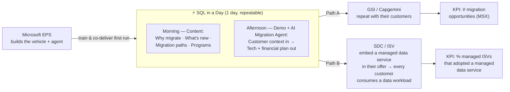
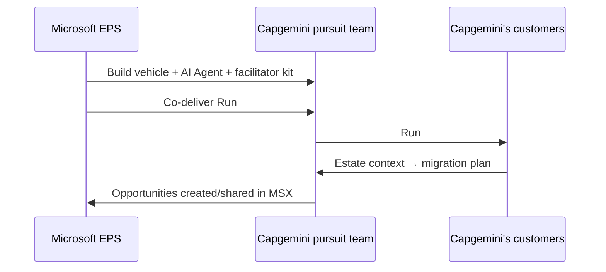
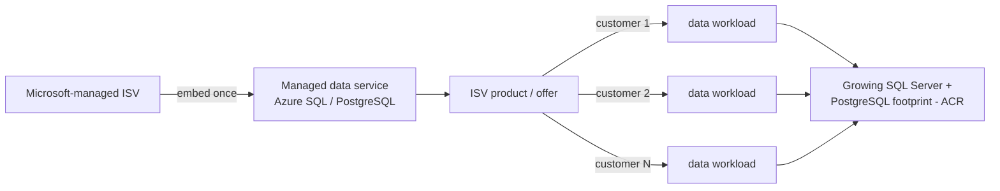
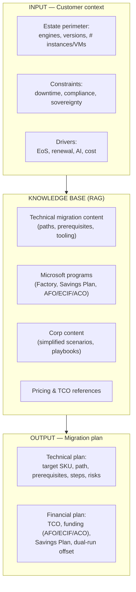

# FY27 EMEA EPS — Data Motion
## Two Paths to Azure SQL, enabled through **"SQL in a Day"**

> **Status:** Draft for v-team review — to be finalized within two weeks and shared with management end of June.
> **Geography:** EMEA · **Owner:** EPS Tech / GTM · **Linked to:** Corp "Accelerate SQL Migration" motion

---

## 1. Executive Summary

This document defines **one motion with two execution paths**, both powered by a single, repeatable enablement vehicle: **"SQL in a Day"**.

| Path | Partner type | Outcome we drive | Primary KPI |
|------|--------------|------------------|-------------|
| **A — Migration** | **System Integrators (GSI)**, starting with **Capgemini** | Migrate on-prem SQL Server workloads to **Azure SQL** — or to **SQL database in Microsoft Fabric** (transactional / operational database) where it fits | **# of migration opportunities created (MSX)** |
| **B — Adoption** | **Software Development Companies (SDC)** | Get every Microsoft-managed ISV to **embed a managed data service** (Azure SQL / Azure Database for PostgreSQL) **inside their offer**, so every end-customer **mechanically consumes a data workload** — growing our **SQL Server + PostgreSQL footprint** | **% of managed ISVs that adopted a managed data service** |

**The core idea.** Microsoft does *not* build new migration tooling — we already have mature programs and tools (Azure Migrate, DMA, DMS, SSMA, Cloud Accelerate Factory, Azure Accelerate). What we build is **one turnkey, repeatable vehicle — "SQL in a Day" — that a GSI like Capgemini can run themselves** with their own customers:

- **Morning = content** — why migrate, what's new, migration paths (to Azure SQL and, where it fits, to **SQL database in Microsoft Fabric** — a fully managed transactional database), and the Microsoft programs.
- **Afternoon = the AI Migration Agent in action** — a **RAG-based asset we build** that is **an integral part of "SQL in a Day"**. It is **demoed and executed live on the customer's own estate data** brought into the session, ingesting Microsoft's complete migration knowledge (technical, programmatic, commercial) plus the **customer's context and perimeter**, and producing an **operable technical migration plan and a financial plan**.

The **AI Migration Agent is the one asset we create** — but it lives **inside** the vehicle (the afternoon), not as a standalone tool.

**Why this is different from the existing corp material.** The corp DB Acceleration and GTM Sprint decks are strong but **high-level and complex**. This motion is deliberately **execution-first**: simplified content, a fixed agenda, a reusable agent embedded in the day, and a clear "train-the-partner-to-repeat" model. Our success is measured by **partners independently repeating "SQL in a Day"**, not by Microsoft running every event.

---

## 2. The Motion at a Glance

**Operating principle — "We build it, the partner repeats it."**
For every motion in FY27 EPS, we ship a **highly operational vehicle** (here: *SQL in a Day*; for the App motion: *Micro Hack*). Microsoft builds and co-delivers the **first** run; the partner then **owns and repeats** the exercise with their own client base.

---

## 3. Strategic Context (the simplified "why now")

This is the **one-slide version** of the corp narrative — enough to open a customer conversation, no more.

- **AI runs on data.** 60% of AI projects without AI-ready data will be abandoned (Gartner); 83% of leaders say stronger data infrastructure would speed AI adoption (Accenture). Modern, managed databases are the foundation.
- **A hard deadline creates urgency.** **SQL Server 2016 reaches End of Support in July 2026** (Windows Server 2016 in January 2027). Extended Security Updates become a recurring cost with no exit — migration is the exit.
- **The estate is large and stuck.** EMEA holds a **~$670M database TAM across ~5,600 accounts**, but renewals are too often treated as transactional licensing events instead of modernization triggers.
- **Partners multiply impact.** When an opportunity is shared with a partner, Microsoft sees **+95.6% higher win rate and +46% larger deal size**. Scaling through GSIs and SDCs is the only way to cover the estate.

> **Three customer frictions to anchor on:** ① stay ahead of AI-era security threats, ② reduce the rising cost of on-prem SQL, ③ unblock AI innovation with AI-ready managed data.

---

## 4. Path A — SI Migration (focus: GSI / Capgemini)

### 4.1 Objective & KPI

| Item | Definition |
|------|------------|
| **Objective** | Enable GSIs to **migrate customer SQL Server estates to Azure SQL** at scale, led by the partner — or to **SQL database in Microsoft Fabric** (a fully managed transactional database) where it fits. |
| **Primary KPI** | **Number of migration opportunities created in MSX** (partner-sourced or partner-shared). |
| **Secondary KPIs** | # of "SQL in a Day" events **repeated by the partner**; # customer estates assessed by the AI Migration Agent; Azure SQL pipeline (ACR) attached. |
| **Lead role** | STU per country + EPS (PDM/PSA), 1 executive sponsor per GSI. |

### 4.2 The Vehicle — "SQL in a Day" agenda

A fixed, repeatable one-day format. Microsoft co-delivers run #1 with the GSI; the GSI repeats runs #2…N independently.

| Time | Block | Content | Owner (run #1 → repeat) |
|------|-------|---------|-------------------------|
| **Morning** | **1. Why migrate** | The 3 frictions (security, cost, AI), the EoS 2016 compelling event, the cost of doing nothing. | MS → Partner |
| | **2. What's new** | SQL Server 2025 & Azure SQL: AI-ready capabilities (built-in vector search, agent-native features), managed PaaS benefits, lower TCO vs IaaS. | MS → Partner |
| | **3. Migration paths** | The 5 simplified scenarios (see §7) and how to choose; PaaS vs IaaS decision; landing zones. | MS → Partner |
| | **4. Programs & economics** | Cloud Accelerate Factory (zero-cost delivery), Database Savings Plan (up to 35%), Azure Frontier Offer (ECIF/ACO funding). | MS → Partner |
| **Afternoon** | **5. Live demo** | A reference migration end-to-end on a sample estate (assess → plan → migrate → validate) using existing Microsoft tooling. | MS → Partner |
| | **6. ⭐ AI Migration Agent** | The partner brings a **real (anonymized) customer estate**; the agent produces a **technical + financial migration plan** live. | MS → Partner |
| | **7. Plan & next steps** | Turn the agent output into an MSX opportunity + a 90-day plan. | MS + Partner |

> **The afternoon is the differentiator.** Block 6 is where the **AI Migration Agent** turns a generic workshop into a concrete, customer-specific migration plan — the artifact the GSI uses to open and qualify a real opportunity.

### 4.3 Repeatability — how Capgemini runs its own "SQL in a Day"

The motion only scales if **Capgemini repeats it without us**. We deliver a **"SQL in a Day in a Box"** package:

- **Facilitator kit:** slide deck (morning content), demo script, timing guide, FAQ.
- **Agent access:** a guided way for the partner to run the AI Migration Agent on their customers' estates.
- **Train-the-trainer:** run #1 is co-delivered; we certify a Capgemini "pursuit team" (presales + delivery) to run runs #2…N.
- **Repeatability KPI:** number of partner-led "SQL in a Day" sessions and opportunities they generate (tracked in MSX).

### 4.4 Execution plan (Path A)

| Phase | What | Who | Done when |
|-------|------|-----|-----------|
| **0 — Build** | Finalize vehicle, agent, facilitator kit | EPS Tech | Kit ready, agent piloted |
| **1 — Recruit** | Secure 1 sponsor per GSI; start with Capgemini | PDM + STU | Sponsor + pursuit team named |
| **2 — Co-deliver** | Run #1 with Capgemini (8 meetings, STU-led per country) | MS + Capgemini | Run #1 delivered, team certified |
| **3 — Repeat** | Capgemini runs sessions with own customers | Capgemini | ≥ N sessions, opportunities in MSX |
| **4 — Scale** | Extend to Accenture/Avanade, NTT Data, TCS, IBM (Nordcloud) | PDM | Each GSI has a pursuit team |

---

## 5. Path B — SDC Adoption (grow the data footprint through ISV offers)

### 5.1 Objective & KPI

| Item | Definition |
|------|------------|
| **Objective** | Get **every Microsoft-managed ISV to embed a managed data service** (Azure SQL or Azure Database for PostgreSQL) **inside their commercial offer** — so that **every time one of their customers uses the ISV's product, a managed data workload is consumed by design**. The aim is to **grow our SQL Server and PostgreSQL footprint mechanically** through ISV adoption, not through one-off migrations. |
| **Why it matters** | **Embed once, consume many.** When an ISV standardizes its product on a managed Azure data service, its **entire customer base** becomes ongoing SQL Server / PostgreSQL consumption — one product decision creates recurring, multi-tenant data footprint. |
| **Primary KPI** | **% of Microsoft-managed ISVs that adopted a managed data service** in their offer (target: every managed ISV ships ≥ 1 managed Azure data service). |
| **Secondary KPIs** | **Azure SQL + PostgreSQL consumption (ACR)** generated through ISV end-customers; # of ISV products standardized on a managed service; # of end-customers consuming the embedded service. |
| **Approach** | **Adoption / Operate** — embed the managed data service once in the product, then consume mechanically across the ISV's customer base. |

### 5.2 How it works — embed once, consume mechanically

For SDCs the target is the **ISV's own product/offer**, not a single end-customer estate. The mechanism:

1. **Target the product, not one estate** — work with the ISV on the data layer of their SaaS / offer.
2. **Embed a managed data service** (Azure SQL or Azure Database for PostgreSQL) as the product's standard data layer — moving away from self-managed DBs on IaaS or other clouds.
3. **Consume mechanically** — every customer that subscribes to the ISV's offer runs that managed workload, so consumption scales with the ISV's business, with no per-customer selling effort from us.
4. **Repeat** across the ISV's product modules and across the managed-ISV portfolio.

> The **"SQL in a Day"** vehicle and the **AI Migration Agent** can serve as the **technical entry point** for an ISV — to assess the current data layer and choose the right managed target. But Path B is ultimately measured on **adoption and mechanical consumption**, not on repeated workshops: the win is the embed, and the footprint it generates across the ISV's customer base.

### 5.3 KPIs for the SDC track (detail)

| KPI | Definition | Target (FY27) |
|-----|------------|---------------|
| **Adoption rate** | % of Microsoft-managed ISVs that embed a managed data service in their offer | *to set with v-team* |
| **Footprint (consumption)** | Azure SQL + PostgreSQL ACR generated through ISV end-customers | *to set* |
| **End-customer reach** | # of ISV end-customers consuming the embedded managed service | *to set* |
| **Repeatability** | % of ISVs that embed a managed service in a 2nd product/module | *to set* |

---

## 6. The AI Migration Agent (the build)

> **This is the one technical asset Microsoft builds in this motion** — and it is **an integral part of "SQL in a Day"**, demoed and run live in the afternoon on the customer's own data (see §4.2). It is **not** a migration tool — it is a **RAG-based advisor** that produces a plan. Execution is done with existing Microsoft tooling and programs.

### 6.1 What it is — and what it is **not**

| It **is** | It is **not** |
|-----------|---------------|
| A **Retrieval-Augmented Generation (RAG)** assistant over Microsoft's complete SQL migration knowledge | A migration engine / schema converter / data-movement tool |
| An advisor that recommends the **right migration path** per customer ask | A replacement for Azure Migrate, DMA, DMS, SSMA |
| A generator of an **operable technical plan + financial plan** | A pricing-quote system of record |

### 6.2 Inputs → Knowledge → Outputs

### 6.3 Knowledge base contents (what we curate)

The agent's knowledge is the **consolidated, simplified** version of what Microsoft already publishes, plus the corp content:

- **Technical migration assets:** supported source→target paths, prerequisites/blockers, assessment guidance, tooling map (Azure Migrate, **DMA**, **DMS**, **SSMA**), landing zone basics.
- **Rationale ("why migrate"):** the 3 frictions, EoS timeline, AI-readiness, TCO.
- **Microsoft programs & funding:** Cloud Accelerate Factory (zero-cost), **Database Savings Plan** (up to 35%), **Azure Frontier Offer** (ECIF 2:1 up to $500K, ACO 2:1 up to $500K for dual-run), Partner Migration Kit, SQL Renewal Playbook.
- **Commercial/financial references:** TCO inputs, savings-plan economics, funding eligibility.

### 6.4 Output spec

#### A. Technical migration plan (operable)

- Recommended target (Azure SQL DB / MI / SQL on Azure VM, or Azure DB for PostgreSQL) per workload.
- Chosen migration **path & scenario** with justification.
- **Prerequisites & blockers** checklist.
- **Step-by-step** sequence (assess → remediate → migrate → validate → cutover) mapped to existing Microsoft tools.
- **Risk & downtime** profile and rollback approach.

#### B. Financial plan

- **TCO** comparison (current on-prem/IaaS vs Azure PaaS).
- Applicable **funding** (AFO/ECIF/ACO) and **Database Savings Plan** savings.
- **Dual-run** cost offset and indicative timeline-to-value.

### 6.5 Build approach (high level)

- **Pattern:** RAG over a curated knowledge index (grounded, citable answers).
- **Inputs:** structured customer-context intake (form or conversation) capturing estate + constraints + drivers.
- **Grounding:** only Microsoft-approved sources; every recommendation is traceable to a source.
- **Guardrails:** the agent recommends and plans; it never executes migrations or commits pricing.
- **Delivery surface:** usable live in the "SQL in a Day" afternoon, and by partners during their own repeats.

> Detailed technical design (index, retrieval, orchestration, hosting) to be specified in a follow-up build doc once the motion is approved.

---

## 7. Microsoft Assets & Programs to lean on (simplified catalog)

The **simplified** version of the corp material — the minimum a partner needs to know.

### 7.1 The 5 migration scenarios (simplified)

| # | Scenario | One-line objective | Compelling event |
|---|----------|--------------------|------------------|
| 1 | **SQL Renewal → Azure** | Convert a SQL renewal into modernization on Azure PaaS | SA/renewal expiry |
| 2 | **SQL EoS → Azure** | Migrate End-of-Support 2012/2014/2016 to Azure SQL | **EoS July 2026** |
| 3 | **Arc → Azure** | Convert Arc-discovered SQL estates to Azure SQL | Discovered estate |
| 4 | **Attach DB to M&M / AI & Apps** | Attach Azure DB to existing modernization/AI opportunities | Active opportunity |
| 5 | **Attach DB to MACC** | Attach Azure DB to MACC pipeline | MACC in pipe |

### 7.2 Programs & funding (simplified)

| Program | What it gives the partner | Use it to… |
|---------|---------------------------|-----------|
| **Cloud Accelerate Factory** | **Zero-cost** Microsoft deployment assistance, joint delivery | Reduce delivery cost/risk |
| **Database Savings Plan** | Up to **35%** vs PAYG | Create urgency & entry |
| **Azure Frontier Offer (AFO)** | **ECIF** 2:1 up to $500K (services) + **ACO** 2:1 up to $500K (dual-run) | Fund post-sales execution |
| **Partner Migration Kit** | Pitch decks, migration guides, FAQ | Enable the pursuit team |
| **SQL Renewal Playbook** | Stage-by-stage renewal→modernization framework | Time the T-12 motion |

### 7.3 Tooling map (we reuse — we do not rebuild)

| Need | Existing Microsoft tool |
|------|------------------------|
| Discover & assess estate | **Azure Migrate**, **DMA** (Data Migration Assistant) |
| Move schema/data | **DMS** (Database Migration Service), **SSMA** (for heterogeneous) |
| Plan landing zone | Azure Landing Zone / Portal Accelerator |
| Optimize cost | Azure Pricing + Database Savings Plan |

---

## 8. KPIs & Success Metrics (both paths)

| Path | Leading indicator | Lagging / outcome KPI |
|------|-------------------|-----------------------|
| **A — SI Migration** | # "SQL in a Day" sessions **repeated by partner**; # estates analyzed by the agent | **# migration opportunities (MSX)**; Azure SQL ACR pipeline |
| **B — SDC Adoption** | # managed ISVs engaged; # offers with a managed data service embedded | **% managed ISVs that adopted a managed data service**; **SQL Server + PostgreSQL ACR** from ISV end-customers |
| **Repeatability (motion health)** | Ratio of partner-led vs MS-led sessions | Partner-sourced opportunities share |

> **North-star for this motion:** the share of "SQL in a Day" sessions and opportunities that are **partner-led, not Microsoft-led**.

---

## 9. The Ask

- **Funding** to build the vehicle + AI Migration Agent and to run the first co-delivered sessions.
- **8 meetings** — STU lead per country to land Path A with GSIs.
- **1 executive sponsor per GSI** (start with **Capgemini**).
- Alignment with the **corp "Accelerate SQL Migration" motion** so this motion is its **execution layer**, not a parallel track.

---

## 10. Execution Roadmap

**FY27 fiscal quarters** (Microsoft FY starts in July): **Q1** Jul–Sep '26 · **Q2** Oct–Dec '26 · **Q3** Jan–Mar '27 · **Q4** Apr–Jun '27.

| Workstream | Q1 · Jul–Sep '26 | Q2 · Oct–Dec '26 | Q3 · Jan–Mar '27 | Q4 · Apr–Jun '27 |
|------------|:---------------:|:---------------:|:---------------:|:---------------:|
| **Build** — Vehicle + facilitator kit | █████ |  |  |  |
| **Build** — AI Migration Agent (RAG) pilot | █████ |  |  |  |
| **Path A** — Sponsor + pursuit team | █████ |  |  |  |
| **Path A** — Co-deliver Run #1 (Capgemini) ◆ | █████ |  |  |  |
| **Path A** — Capgemini repeats (own customers) |  | █████ | █████ |  |
| **Path A** — Scale to other GSIs |  | █████ | █████ |  |
| **Path B** — ISV assessment + first adoptions | █████ | █████ |  |  |
| **Path B** — Repeat across portfolio |  | █████ | █████ |  |

**Key milestones**

- **◆ Run #1 co-delivered with Capgemini — end of Q1 (Sep '26):** first "SQL in a Day" + AI Migration Agent delivered live; pursuit team certified.
- **End of Q1:** vehicle + agent are in the partner's hands — the motion shifts from *Microsoft build* to *partner-led repeat*.
- **Q2–Q3:** Capgemini repeats independently while we scale to other GSIs (Accenture/Avanade, NTT Data, TCS, IBM/Nordcloud); SDC adoptions run in parallel.

*Legend:* █████ = active period · ◆ = key milestone.

---

## 11. Appendix — "Why migrate" in one page (partner-ready)

**The three frictions (use to open any conversation):**
1. **Security in the AI era** — modernize before EoS dates to stay secure and supported (SQL Server 2016 EoS July 2026).
2. **Cost** — move off rising on-prem/ESU costs to managed PaaS with lower TCO and up to 35% savings.
3. **AI innovation** — unify data on managed PaaS with built-in AI capabilities (vector search, agent-native features), ready for production AI.

**What "good" looks like:** every SQL renewal or EoS conversation becomes a **90-day modernization plan**, generated by the AI Migration Agent, owned and repeated by the partner.

---

*Sources distilled and simplified from: "FY27 proposal data motion" (EPS), "FY27 EMEA EPS DB Acceleration — To Partner" and "FY27 EMEA EPS GTM Sprint — DB Acceleration" (EPS v-team). This document intentionally simplifies the corp material into an execution-ready format.*
