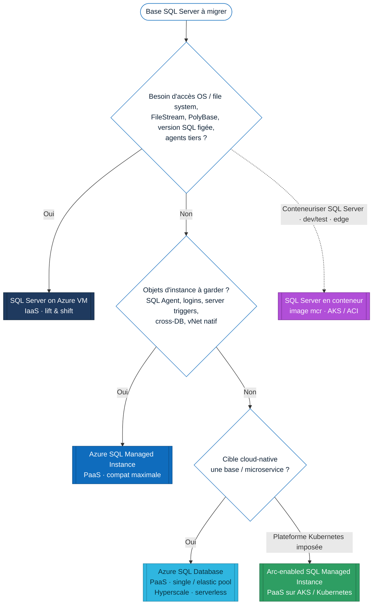
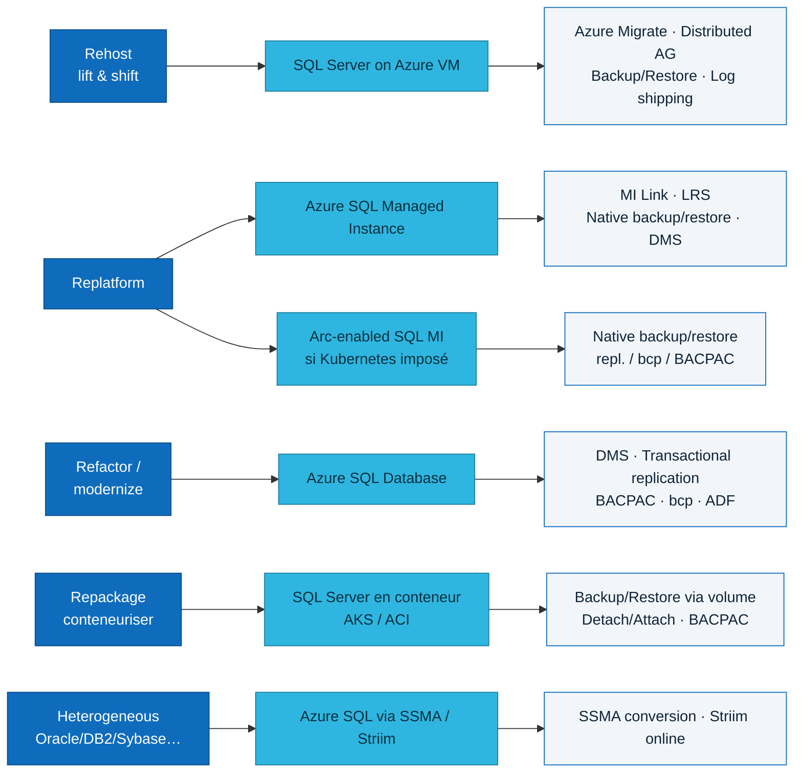

# Migrer SQL Server vers Azure — inventaire exhaustif des cibles, méthodes et outils

> **But.** Lister de façon **exhaustive** toutes les façons et tous les outils pour migrer une base **SQL Server** vers **un service Azure** (tous les PaaS, y compris **conteneurs**) ou **une VM Azure**.
>
> **Vérification.** Chaque cible et chaque méthode renvoie à une page **Microsoft Learn** officielle (docs à jour 2026). Les sections « conteneurs » s'appuient sur **Azure Arc-enabled SQL Managed Instance** (moteur SQL MI sur Kubernetes/AKS) et sur l'**image conteneur SQL Server** (`mcr.microsoft.com/mssql/server`) — toutes deux documentées. Les liens sont regroupés en [§8 Sources](#8-sources-microsoft-learn).

---

## 0. En une minute — quelle cible choisir ?

**Règle générale (Microsoft Learn).** Le couple de démarrage cohérent est **Azure Migrate** (discovery / assessment / sizing / business case) **+** **Azure Database Migration Service (DMS)** (migration managée), puis le **véhicule de données** adapté à la cible et à la fenêtre de coupure (MI Link, LRS, native backup/restore, distributed AG, etc.).

---

## 1. Les cibles Azure (targets)

| Cible | Modèle | Quand la choisir | Compatibilité SQL Server | Doc officielle |
| --- | --- | --- | --- | --- |
| **Azure SQL Database** | PaaS — base | App cloud-native / microservice ; on accepte d'abandonner les dépendances d'instance (SQL Agent…). Modèles : single DB / elastic pool ; tiers **General Purpose / Business Critical / Hyperscale** ; achat **vCore / DTU / serverless**. | Surface base de données (instance-level non supporté) | [Migration overview](https://learn.microsoft.com/en-us/data-migration/sql-server/database/overview) |
| **Azure SQL Managed Instance** | PaaS — instance | Le moins de changements applicatifs ; conserver logins, SQL Agent jobs, server triggers, cross-DB, **vNet natif**. Tiers **GP / BC**. | ~Quasi-totale (instance) | [Migration overview](https://learn.microsoft.com/en-us/data-migration/sql-server/managed-instance/overview) |
| **SQL Server on Azure VM** | IaaS | « Lift & shift » fidèle : contrôle OS / file system, version SQL précise, FileStream/FileTable, PolyBase, agents tiers. | Totale (c'est SQL Server) | [Migration overview](https://learn.microsoft.com/en-us/data-migration/sql-server/virtual-machines/overview) |
| **Azure Arc-enabled SQL Managed Instance** | PaaS **sur Kubernetes / AKS** (conteneurs) | Moteur SQL MI managé qui tourne **dans des conteneurs** sur AKS, un autre cloud, l'edge ou on-prem — quand la plateforme **Kubernetes** est imposée mais qu'on veut l'expérience MI. | ~Comme SQL MI | [Arc-enabled SQL MI](https://learn.microsoft.com/en-us/azure/azure-arc/data/create-sql-managed-instance) · [Arc data services](https://learn.microsoft.com/en-us/azure/azure-arc/data/overview) |
| **SQL Server en conteneur** (image `mcr.microsoft.com/mssql/server`) | Conteneur sur **AKS / ACI / Container Apps** | Contrôle total du moteur SQL Server dans un conteneur (dev/test, edge, déploiements custom). Persistance via Azure Disk / Azure Files. | Totale (binaire SQL Server Linux) | [SQL Server sur Kubernetes](https://learn.microsoft.com/en-us/sql/linux/quickstart-sql-server-containers-kubernetes) · [Conteneur Docker](https://learn.microsoft.com/en-us/sql/linux/quickstart-install-connect-docker) |

> **⚠️ Précision importante — Arc-enabled SQL *Server* ≠ Arc-enabled SQL *Managed Instance*.**
> - **Azure Arc-enabled SQL Server** = **plan de contrôle / expérience** (on « Arc-active » un SQL Server existant pour l'inventaire, l'assessment, et lancer la migration depuis le portail). Ce **n'est pas** une cible runtime. → [Arc migration experience](https://learn.microsoft.com/en-us/sql/sql-server/azure-arc/migration-overview)
> - **Azure Arc-enabled SQL Managed Instance** = **cible runtime conteneurisée** (le moteur SQL MI s'exécute dans des pods sur Kubernetes/AKS). → [Create Arc-enabled SQL MI](https://learn.microsoft.com/en-us/azure/azure-arc/data/create-sql-managed-instance)

---

## 2. Méthodes par cible (vérifiées sur Microsoft Learn)

### 2.1 Vers **Azure SQL Database**

| Méthode | Online / Offline | Usage typique |
| --- | --- | --- |
| [Azure Database Migration Service (DMS)](https://learn.microsoft.com/en-us/azure/dms/dms-overview) | Online + Offline | Service managé recommandé, downtime minimal, à l'échelle. |
| [Transactional replication](https://learn.microsoft.com/en-us/azure/azure-sql/database/replication-to-sql-database) | Online | Sans retirer la base de prod ; possible sur un sous-ensemble tables/colonnes/lignes (push subscription). |
| [Import/Export · BACPAC (SqlPackage)](https://learn.microsoft.com/en-us/azure/azure-sql/database/database-import) | Offline | Petites/moyennes bases, single-DB ; `SqlPackage` pour le scale. |
| [bcp / Smart Bulk Copy](https://learn.microsoft.com/en-us/sql/tools/bcp-utility) | Offline | Migration **data-only** / bulk, full ou partielle, orientée volume. |
| [Azure Data Factory — Copy activity](https://learn.microsoft.com/en-us/azure/data-factory/connector-azure-sql-database) | Offline / batch | Quand la migration est aussi une intégration / transformation (BI). |
| [PowerShell / Azure CLI](https://learn.microsoft.com/en-us/azure/azure-sql/database/single-database-create-quickstart) | Selon moteur | Industrialisation / automatisation du bon véhicule. |

> ❌ **Non supporté pour Azure SQL Database** : restauration native d'un `.bak` (native backup/restore) et detach/attach — ce sont des chemins MI/VM, pas SQL DB.

### 2.2 Vers **Azure SQL Managed Instance**

| Méthode | Online / Offline | Usage typique |
| --- | --- | --- |
| [Managed Instance link (MI Link)](https://learn.microsoft.com/en-us/azure/azure-sql/managed-instance/managed-instance-link-feature-overview) | **Online (near-zero downtime)** | Réplication quasi temps réel (distributed AG) ; cible lisible en R/O pendant la migration ; cutover à tout moment ; workloads critiques. Sources SQL Server 2016→2022. |
| [Log Replay Service (LRS)](https://learn.microsoft.com/en-us/azure/azure-sql/managed-instance/log-replay-service-migrate) | Offline (planned downtime) | Backups full/diff/log poussés vers Azure Blob ; base cible en *restoring* jusqu'au cutover ; public endpoint. |
| [Native backup & restore (.bak)](https://learn.microsoft.com/en-us/azure/azure-sql/managed-instance/restore-sample-database-quickstart) | Offline | Le plus simple si le downtime d'un full backup + restore est acceptable. |
| [Transactional replication](https://learn.microsoft.com/en-us/azure/azure-sql/managed-instance/replication-transactional-overview) | Online | Réplication de tout ou partie de la base (publisher/subscriber). |
| [bcp / Smart Bulk Copy](https://learn.microsoft.com/en-us/samples/azure-samples/smartbulkcopy/smart-bulk-copy/) | Offline | Migrations data-only / partielles à haute vitesse (copie parallèle). |
| [Import/Export · BACPAC](https://learn.microsoft.com/en-us/azure/azure-sql/database/database-import) | Offline | Bases plus petites / migrations simples. |
| [Azure Data Factory — Copy activity](https://learn.microsoft.com/en-us/azure/data-factory/connector-azure-sql-managed-instance) | Offline / batch | Migration = chantier d'intégration / transformation. |
| [SQL Server migration experience in Azure Arc](https://learn.microsoft.com/en-us/sql/sql-server/azure-arc/migrate-to-azure-sql-managed-instance) | Online / Offline | Une fois la source **Arc-enabled** : assessment + migration vers SQL MI depuis le portail (MI Link / LRS). |

### 2.3 Vers **SQL Server on Azure VM** (IaaS)

| Méthode | Online / Offline | Usage typique |
| --- | --- | --- |
| [Azure Migrate](https://learn.microsoft.com/en-us/azure/migrate/migrate-services-overview) | Online (réplication) | **Lift & shift** de la VM/instance entière (jusqu'à ~35 000 VMs), y compris **Failover Cluster Instance** et **Availability Group**. |
| [Distributed availability group](https://learn.microsoft.com/en-us/data-migration/sql-server/virtual-machines/overview) | **Online (minimal downtime)** | Quand un AG existe déjà on-prem ; SQL Server 2016+. |
| [Backup to a file (.bak) + copie vers Azure](https://learn.microsoft.com/en-us/data-migration/sql-server/virtual-machines/guide) | Offline | Technique simple et éprouvée ; supporte > 1 To ; compression conseillée. |
| [Backup to URL (Azure Blob)](https://learn.microsoft.com/en-us/sql/relational-databases/backup-restore/sql-server-backup-to-url) | Offline | Bases < 1 To avec bonne connectivité Azure (SQL 2014+). |
| [Detach & attach (fichiers MDF/LDF via Azure Blob)](https://learn.microsoft.com/en-us/data-migration/sql-server/virtual-machines/guide) | Offline | Déplacement direct des fichiers de données. |
| [Log shipping](https://learn.microsoft.com/en-us/sql/database-engine/log-shipping/about-log-shipping-sql-server) | Minimal downtime | Synchronisation continue par log backups jusqu'au cutover. |
| [Always On availability group](https://learn.microsoft.com/en-us/data-migration/sql-server/virtual-machines/availability-group-migrate) | Online | Bascule d'un AG existant vers des réplicas sur Azure VM. |
| [Convertir la machine on-prem en VM Azure / Ship hard drive](https://learn.microsoft.com/en-us/azure/migrate/migrate-services-overview) | Offline | Estates volumineux, bande passante limitée. |
| [DMS (dans le flux Azure SQL)](https://learn.microsoft.com/en-us/azure/dms/dms-overview) | Selon scénario | Orchestration managée quand la cible VM est exposée dans le flux guidé. |

### 2.4 Vers **Azure Arc-enabled SQL Managed Instance** (conteneurs / AKS)

C'est le moteur **SQL MI** exécuté dans des **pods Kubernetes** (AKS ou tout cluster). Prérequis : cluster K8s + **Arc data controller** déployé. → [Déploiement](https://learn.microsoft.com/en-us/azure/azure-arc/data/create-sql-managed-instance)

| Méthode | Online / Offline | Usage typique |
| --- | --- | --- |
| [Native backup & restore (.bak)](https://learn.microsoft.com/en-us/azure/azure-arc/data/migrate-to-arc-enabled-sql-managed-instance) | Offline | Restaurer un backup SQL Server natif dans l'instance Arc MI. |
| [Point-in-time / restore vers Arc MI](https://learn.microsoft.com/en-us/azure/azure-arc/data/migrate-to-arc-enabled-sql-managed-instance) | Offline | Migration de base par restore managé côté Arc. |
| Transactional replication / bcp / BACPAC / ADF | Online (repl.) / Offline | Mêmes véhicules « logiques » que SQL MI, la cible étant un endpoint SQL MI. |

> Comme Arc MI expose un **endpoint SQL Managed Instance**, les véhicules data-logiques de [§2.2](#22-vers-azure-sql-managed-instance) s'appliquent ; la spécificité est l'**hébergement conteneurisé** sur Kubernetes.

### 2.5 Vers **SQL Server en conteneur** (image `mcr` sur AKS / ACI / ACA)

SQL Server tourne dans un conteneur Linux ; la base est persistée sur **Azure Disk** (AKS) ou **Azure Files** (ACI). → [SQL Server sur Kubernetes/AKS](https://learn.microsoft.com/en-us/sql/linux/quickstart-sql-server-containers-kubernetes)

| Méthode | Online / Offline | Usage typique |
| --- | --- | --- |
| [Backup / Restore (.bak via volume monté)](https://learn.microsoft.com/en-us/sql/relational-databases/backup-restore/back-up-and-restore-of-sql-server-databases) | Offline | Voie standard : `BACKUP DATABASE` côté source → `RESTORE` dans le pod (volume Azure Files/Disk). |
| [Detach & attach (MDF/LDF sur volume persistant)](https://learn.microsoft.com/en-us/sql/relational-databases/databases/database-detach-and-attach-sql-server) | Offline | Attacher les fichiers de données dans le conteneur. |
| BACPAC / bcp / ADF / Transactional replication | Offline / Online | Migration logique vers l'endpoint SQL du conteneur (`,1433`). |

---

## 3. Les outils & services — quoi, pour quoi

| Outil / service | Rôle | Cibles | Online / Offline | Notes |
| --- | --- | --- | --- | --- |
| [Azure Migrate](https://learn.microsoft.com/en-us/azure/migrate/how-to-create-azure-sql-assessment) | Discovery / assessment / sizing / business case à l'échelle | SQL DB · MI · VM | n/a (pas un data-mover) | Démarrage de programme ; recommandations target/SKU/coût. |
| [Azure Database Migration Service (DMS)](https://learn.microsoft.com/en-us/azure/dms/dms-overview) | Service managé d'orchestration de migration | SQL DB · MI · VM (flux Azure SQL) | Online + Offline | Cœur de l'exécution managée (portail / PowerShell / CLI). |
| [Azure SQL Migration extension (Azure Data Studio)](https://learn.microsoft.com/en-us/azure-data-studio/extensions/azure-sql-migration-extension) | Front-end assessment + lancement DMS | SQL DB · MI · VM | Selon véhicule | ⚠️ ADS en fin de vie — fonction consolidée côté DMS / SSMS. |
| [SQL Server Migration Assistant (SSMA)](https://learn.microsoft.com/en-us/sql/ssma/sql-server-migration-assistant) | Conversion **hétérogène** (schéma/code/données) | Azure SQL | Selon scénario | Pour Oracle / Sybase / DB2 / MySQL / Access — **pas** pour SQL→SQL homogène. |
| [Data Migration Assistant (DMA)](https://learn.microsoft.com/en-us/sql/dma/dma-overview) | Assessment / remédiation (legacy) | Azure SQL | n/a | Outil historique ; remplacé par les expériences Azure Migrate / DMS. |
| [Managed Instance link (MI Link)](https://learn.microsoft.com/en-us/azure/azure-sql/managed-instance/managed-instance-link-feature-overview) | Réplication quasi temps réel (distributed AG) | MI (+ Arc MI) | Online | Meilleur minimum-downtime ; cible R/O pendant la migration. |
| [Log Replay Service (LRS)](https://learn.microsoft.com/en-us/azure/azure-sql/managed-instance/log-replay-service-migrate) | Log-shipping managé vers MI | MI | Offline | Backups full/diff/log → Azure Blob. |
| [Native backup & restore](https://learn.microsoft.com/en-us/azure/azure-sql/managed-instance/restore-sample-database-quickstart) | Restauration `.bak` | MI · VM · Arc MI · conteneur | Offline | Le plus simple si downtime acceptable. |
| [Transactional replication](https://learn.microsoft.com/en-us/azure/azure-sql/database/replication-to-sql-database) | Réplication publisher/subscriber | SQL DB · MI | Online | Sous-ensembles possibles ; setup plus complexe. |
| [BACPAC / SqlPackage](https://learn.microsoft.com/en-us/azure/azure-sql/database/database-import) | Export/import schéma + données | SQL DB · MI · conteneur | Offline | Petites/moyennes bases. |
| [bcp / Smart Bulk Copy](https://learn.microsoft.com/en-us/sql/tools/bcp-utility) | Bulk load data-only | SQL DB · MI · conteneur | Offline | Volume / table-level ; copie parallèle. |
| [Azure Data Factory — Copy](https://learn.microsoft.com/en-us/azure/data-factory/connector-azure-sql-managed-instance) | Pipelines de mouvement/transformation | SQL DB · MI | Offline / batch | Quand migration = intégration. |
| [Distributed / Always On AG](https://learn.microsoft.com/en-us/data-migration/sql-server/virtual-machines/availability-group-migrate) | Réplication HA | VM | Online | Réutilise un AG existant. |
| [PowerShell / Azure CLI](https://learn.microsoft.com/en-us/azure/azure-sql/) | Automatisation à l'échelle | Toutes | Selon véhicule | Industrialisation / CI-CD des migrations. |

**Tiers (vérifié dans les sources Microsoft).** Le partenariat **Striim** (FY26) couvre des migrations **online** SQL Server → Azure SQL (DB / MI / VM) et plusieurs paires hétérogènes (Oracle, Sybase, DB2 → Azure SQL ; MongoDB → Cosmos DB). D'autres éditeurs (Redgate, Quest, AWS SCT) existent mais ne sont pas détaillés ici faute de source officielle vérifiée.

---

## 4. Mapping stratégie (« 5 R ») ↔ cible ↔ méthode

---

## 5. Matrice récapitulative — méthode / outil × cible

| Méthode / outil | Azure SQL Database | Azure SQL MI | SQL Server on VM | Arc-enabled SQL MI (AKS) | Conteneur SQL (ACI/AKS) |
| --- | :---: | :---: | :---: | :---: | :---: |
| **Azure Migrate** (assess) | ✅ | ✅ | ✅ | ➖ | ➖ |
| **DMS** | ✅ | ✅ | ✅ (flux Azure SQL) | ➖ | ➖ |
| **MI Link** | ❌ | ✅ (online) | ❌ | ✅ | ❌ |
| **Log Replay Service** | ❌ | ✅ (offline) | ❌ | ➖ | ❌ |
| **Native backup/restore (.bak)** | ❌ | ✅ | ✅ | ✅ | ✅ |
| **Distributed / Always On AG** | ❌ | ❌ | ✅ (online) | ❌ | ❌ |
| **Log shipping** | ❌ | ➖ (LRS) | ✅ | ➖ | ➖ |
| **Detach / attach** | ❌ | ❌ | ✅ | ➖ | ✅ |
| **Transactional replication** | ✅ | ✅ | ✅ | ✅ | ✅ |
| **BACPAC / SqlPackage** | ✅ | ✅ | ✅ | ✅ | ✅ |
| **bcp / Smart Bulk Copy** | ✅ | ✅ | ✅ | ✅ | ✅ |
| **Azure Data Factory (Copy)** | ✅ | ✅ | ✅ | ✅ | ✅ |
| **SSMA** (hétérogène) | ✅ | ✅ | ✅ | ✅ | ✅ |
| **SSMS / ADS migration UI** | ✅ | ✅ | ✅ | ➖ | ➖ |

Légende : ✅ supporté / documenté · ❌ non applicable · ➖ possible mais non « first-class » / indirect.

---

## 6. Online vs Offline (fenêtre de coupure)

```mermaid
flowchart TB
    subgraph ON["🟢 Online · minimum downtime"]
        O1[MI Link]
        O2[Distributed / Always On AG]
        O3[Transactional replication]
        O4[Log shipping]
        O5[Striim &#40;tiers&#41;]
    end
    subgraph OFF["🟠 Offline · downtime planifié"]
        F1[Native backup/restore]
        F2[Log Replay Service]
        F3[BACPAC / SqlPackage]
        F4[bcp / Smart Bulk Copy]
        F5[Detach / attach]
        F6[ADF Copy]
    end
    classDef on fill:#2E9E63,stroke:#1F6B43,color:#fff;
    classDef off fill:#E8A13A,stroke:#A86E18,color:#2a1c05;
    class O1,O2,O3,O4,O5 on;
    class F1,F2,F3,F4,F5,F6 off;
```

---

## 7. Grille de décision (recommandations)

- **« Zéro surprise de compatibilité »** → **SQL Server on Azure VM**. Démarre par **Azure Migrate** (inventaire/assessment), puis **backup/restore**, **distributed AG** ou **DMS** selon la fenêtre de coupure.
- **« PaaS avec le moins de douleur »** → **Azure SQL Managed Instance**. Arbitre **MI Link** (online) vs **LRS / native backup-restore** (offline). C'est la cible la mieux documentée.
- **« Cloud-native / refactor »** → **Azure SQL Database**. Chemins : **DMS**, **transactional replication**, **BACPAC/SqlPackage**, **bcp**, **ADF** — en assumant la remédiation des dépendances d'instance.
- **« Kubernetes imposé »** → **Arc-enabled SQL Managed Instance** sur AKS, migration par **native backup/restore** + véhicules logiques.
- **« Conteneuriser SQL Server »** (dev/test, edge) → **image `mcr`** sur **AKS/ACI**, migration par **backup/restore via volume persistant**.
- **« Source hétérogène »** (Oracle/Sybase/DB2/MySQL) → **SSMA** (conversion) et/ou **Striim** (online).

---

## 8. Sources (Microsoft Learn)

**Hubs & overviews**
- Database Migration (hub) — <https://learn.microsoft.com/en-us/data-migration/>
- SQL Server → Azure SQL Database — <https://learn.microsoft.com/en-us/data-migration/sql-server/database/overview>
- SQL Server → Azure SQL Managed Instance — <https://learn.microsoft.com/en-us/data-migration/sql-server/managed-instance/overview>
- SQL Server → SQL Server on Azure VM — <https://learn.microsoft.com/en-us/data-migration/sql-server/virtual-machines/overview>
- Comparatif des fonctionnalités Azure SQL — <https://learn.microsoft.com/en-us/azure/azure-sql/database/features-comparison>

**Outils / services**
- Azure Migrate (assessment SQL) — <https://learn.microsoft.com/en-us/azure/migrate/how-to-create-azure-sql-assessment>
- Azure Database Migration Service — <https://learn.microsoft.com/en-us/azure/dms/dms-overview>
- Managed Instance link — <https://learn.microsoft.com/en-us/azure/azure-sql/managed-instance/managed-instance-link-feature-overview>
- Log Replay Service — <https://learn.microsoft.com/en-us/azure/azure-sql/managed-instance/log-replay-service-migrate>
- Native backup & restore (MI) — <https://learn.microsoft.com/en-us/azure/azure-sql/managed-instance/restore-sample-database-quickstart>
- Transactional replication (SQL DB) — <https://learn.microsoft.com/en-us/azure/azure-sql/database/replication-to-sql-database>
- Import/Export · BACPAC — <https://learn.microsoft.com/en-us/azure/azure-sql/database/database-import>
- bcp utility — <https://learn.microsoft.com/en-us/sql/tools/bcp-utility>
- Smart Bulk Copy — <https://learn.microsoft.com/en-us/samples/azure-samples/smartbulkcopy/smart-bulk-copy/>
- Azure Data Factory (connecteur SQL MI) — <https://learn.microsoft.com/en-us/azure/data-factory/connector-azure-sql-managed-instance>
- SSMA — <https://learn.microsoft.com/en-us/sql/ssma/sql-server-migration-assistant>
- Data Migration Assistant (legacy) — <https://learn.microsoft.com/en-us/sql/dma/dma-overview>

**Conteneurs & Azure Arc**
- Arc-enabled SQL Managed Instance — créer — <https://learn.microsoft.com/en-us/azure/azure-arc/data/create-sql-managed-instance>
- Arc data services (overview) — <https://learn.microsoft.com/en-us/azure/azure-arc/data/overview>
- Migrer vers Arc-enabled SQL MI — <https://learn.microsoft.com/en-us/azure/azure-arc/data/migrate-to-arc-enabled-sql-managed-instance>
- SQL Server migration experience in Azure Arc — <https://learn.microsoft.com/en-us/sql/sql-server/azure-arc/migration-overview>
- SQL Server sur Kubernetes / AKS — <https://learn.microsoft.com/en-us/sql/linux/quickstart-sql-server-containers-kubernetes>
- SQL Server en conteneur Docker — <https://learn.microsoft.com/en-us/sql/linux/quickstart-install-connect-docker>
- Azure Container Instances (overview) — <https://learn.microsoft.com/en-us/azure/container-instances/container-instances-overview>

**VM — méthodes**
- Backup to URL — <https://learn.microsoft.com/en-us/sql/relational-databases/backup-restore/sql-server-backup-to-url>
- Availability group → Azure VM — <https://learn.microsoft.com/en-us/data-migration/sql-server/virtual-machines/availability-group-migrate>
- Detach & attach — <https://learn.microsoft.com/en-us/sql/relational-databases/databases/database-detach-and-attach-sql-server>
- Log shipping — <https://learn.microsoft.com/en-us/sql/database-engine/log-shipping/about-log-shipping-sql-server>

> *Dernière vérification des liens : juin 2026. Les guides de migration Microsoft ont été déplacés de `…/azure-sql/migration-guides/…` vers `…/data-migration/sql-server/…` (redirections en place).*
