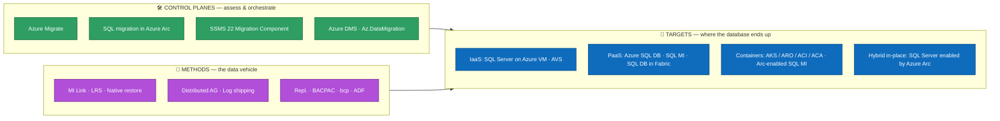
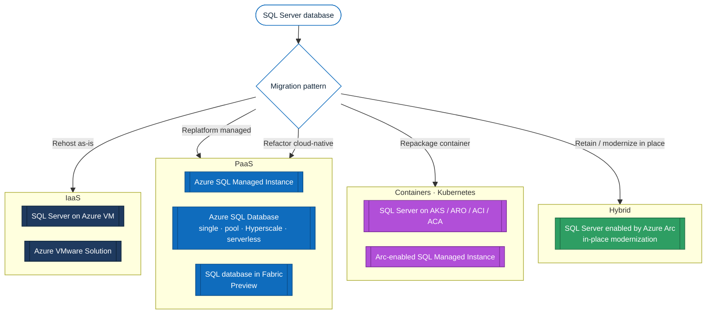
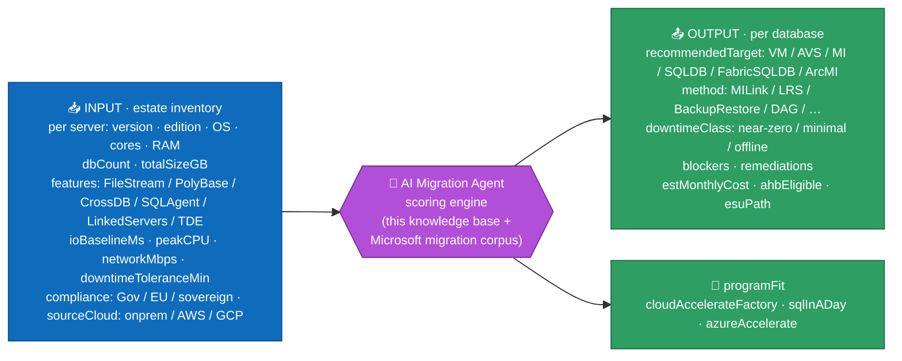

# Migrating SQL Server to Azure — exhaustive inventory of targets, methods and tools

> **Goal.** Exhaustively list every way and every tool to migrate a **SQL Server** database to **an Azure service** (all PaaS, including **containers**) or **a VM** (Azure VM / Azure VMware Solution).
>
> **Audience.** Partners, architects, and customer DBAs — usable in pre-sales and as the knowledge base behind the *SQL in a Day* **AI Migration Agent** ([§14](#14-fy27-sql-motion-context--ai-migration-agent)).
>
> **Verification.** Tool retirements, version requirements and target families were cross-checked against Microsoft Learn and product announcements (current as of **June 2026**). Links are gathered in [§15 Sources](#15-sources-microsoft-learn).

> [!IMPORTANT]
> **2025–2026 tooling reset — read this first.**
> - **Data Migration Assistant (DMA)** is **RETIRED (16 July 2025)**.
> - **Azure Data Studio (ADS)** and its **Azure SQL Migration extension** are **RETIRED (28 February 2026)**.
> - The new entry point is the **SSMS 22 Migration Component** (assess + migrate from SSMS), complemented by **SQL Server migration in Azure Arc** (portal, with Copilot) and **Azure Database Migration Service (DMS)**.
> - Modern **DMS** supports **offline-only** migration to **Azure SQL Database** (online / minimal-downtime is available for **Managed Instance** and **SQL VM** targets, per the [DMS supported-scenarios](https://learn.microsoft.com/en-us/azure/dms/resource-scenario-status) matrix).
> - **Azure DMS *classic*** SQL Server scenarios are **RETIRED (15 March 2026)** — use the **modern** DMS (an Azure resource, via portal / PowerShell / CLI).

---

## 1. Why migrate in 2026 (the short "why now")

- **AI runs on data.** Modern, managed databases are the foundation; **SQL Server 2025** (GA **18 Nov 2025**) adds a **native `vector` type**, **native `json` type**, and Fabric Mirroring optimizations — making the engine AI-ready and improving migration (enhanced distributed AG).
- **End-of-support pressure.** Out-of-support SQL Server/Windows versions push modernization; **Extended Security Updates (ESU)** are **free on Azure VMs**, and for on-prem are delivered **only via Azure Arc** (paid) — this changes the *stay vs migrate* math.
- **Cost levers.** **Azure Hybrid Benefit (AHB)** applies to SQL DB (vCore), Managed Instance and VM (not to Fabric SQL DB) — up to ~85% savings when combined with reservations/ESU.
- **Partner leverage.** Sharing a deal with a partner increases win rate and deal size; programs like **Cloud Accelerate Factory** and **SQL in a Day** industrialize delivery ([§14](#14-fy27-sql-motion-context--ai-migration-agent)).

---

## 2. Taxonomy — separate **targets**, **control planes**, and **methods**

The single most common mistake is to mix these three layers. Keep them distinct:

- **Targets** = runtime destinations (where the DB lives).
- **Control planes / experiences** = how you assess, recommend and orchestrate (Azure Migrate, Arc, SSMS 22, DMS). **Azure Arc-enabled SQL *Server* is a control plane**, not a runtime target.
- **Methods** = the actual data-movement vehicle (MI Link, LRS, backup/restore, replication…).

---

## 3. The Azure targets (8 families)

| # | Target | Layer | When to choose it | Compatibility | Doc |
| --- | --- | --- | --- | --- | --- |
| 1 | **SQL Server on Azure VM** | IaaS | Faithful lift & shift: OS / file-system control, exact version, FileStream/FileTable, PolyBase, cross-instance DTC, third-party agents. | Full | [overview](https://learn.microsoft.com/en-us/data-migration/sql-server/virtual-machines/overview) |
| 2 | **Azure VMware Solution (AVS)** | IaaS | Zero-refactor data-center exit for existing VMware estates; keeps **FCI** and **Always On AG**; migrate with **VMware HCX / vMotion**. | Full | [AVS](https://learn.microsoft.com/en-us/azure/azure-vmware/introduction) |
| 3 | **Azure SQL Managed Instance** | PaaS | **Managed lift-and-shift**: keep instance objects (logins, SQL Agent, server triggers, cross-DB, linked servers), native vNet. Tiers GP / BC. | ~Near-full (instance) | [overview](https://learn.microsoft.com/en-us/data-migration/sql-server/managed-instance/overview) |
| 4 | **Azure SQL Database** | PaaS | Cloud-native app / microservice. Models: **single DB / elastic pool**; tiers **GP / BC / Hyperscale**; purchasing **vCore / DTU / serverless**. **Hyperscale** for > 4 TB or HTAP; **serverless** for intermittent workloads; **elastic pools** for consolidation. | Database surface (no instance-level) | [overview](https://learn.microsoft.com/en-us/data-migration/sql-server/database/overview) |
| 5 | **SQL database in Fabric** *(Preview for migration)* | PaaS | Fabric-native OLTP unified with OneLake. Migrate via **Fabric Migration Assistant** (DACPAC schema **≤ 20 MB**, **on-prem data gateway only**, no Private Link). **Not** an enterprise OLTP target yet. | Subset; preview | [Migration Assistant](https://learn.microsoft.com/en-us/fabric/database/sql/migration-assistant) |
| 6 | **SQL Server in containers — AKS / ARO / ACI / ACA** | Container | Full control of the engine in a container (dev/test, edge, custom). Pod + **PersistentVolume**; HA via the Kubernetes scheduler. | High — SQL on Linux (**no FILESTREAM/FileTable, SSRS/SSAS/SSIS, ML Services; SQL Agent off by default**) | [SQL on Kubernetes](https://learn.microsoft.com/en-us/sql/linux/quickstart-sql-server-containers-kubernetes) |
| 7 | **Azure Arc-enabled SQL Managed Instance** | Container (PaaS) | Managed SQL MI engine on **any Kubernetes** (AKS, ARO, EKS, GKE, OpenShift) via `kubectl`+CRD. Sovereignty / edge / multi-cloud. | ~Same as SQL MI | [create Arc SQL MI](https://learn.microsoft.com/en-us/azure/azure-arc/data/create-sql-managed-instance) |
| 8 | **SQL Server enabled by Azure Arc** | Hybrid (control plane) | **Not a runtime target** — modernize *in place*: inventory, assessment, **best-practices assessment**, ESU, and a portal **Database migration** experience (Copilot-assisted) to MI/VM. | n/a | [Arc migration](https://learn.microsoft.com/en-us/sql/sql-server/azure-arc/migration-overview) |

> **Lift & shift is not VM-only.** Both **SQL Server on Azure VM** (IaaS) and **Azure SQL Managed Instance** (managed PaaS) are valid lift-and-shift targets. Since 2024, MI compatibility (SQL Agent, cross-DB queries, linked servers…) makes it the default *managed* lift-and-shift.

---

## 4. Control planes & assessment experiences

| Tool / experience | Role | Status (2026) | Notes |
| --- | --- | --- | --- |
| [Azure Migrate](https://learn.microsoft.com/en-us/azure/migrate/how-to-create-azure-sql-assessment) | Discovery / assessment / sizing / business case at scale | GA (+ **Arc-based agentless discovery**, Preview) | Appliance (VMware/Hyper-V/Physical) **or** import-based **or** Arc-based. Right-sizes SQL DB / MI / VM. |
| [SQL Server migration in Azure Arc](https://learn.microsoft.com/en-us/sql/sql-server/azure-arc/migration-overview) | Portal-driven assess + migrate for any **Arc-enabled** SQL Server | GA; **MI** target GA, **VM** target Preview | **Copilot** recommends method (MI Link vs LRS); continuous assessment; supports sources from SQL Server 2012+. |
| [SSMS 22 Migration Component](https://learn.microsoft.com/en-us/sql/ssms/sql-server-management-studio-ssms) | DBA-first entry point: assess + launch the right path from SSMS | GA (Windows-only) | Replaces DMA / ADS extension. Backup/restore, MI Link, DMS. Azure SQL assessment capability expected **~Q3 CY2026** *(public roadmap, subject to change)*. |
| [Azure DMS (modern)](https://learn.microsoft.com/en-us/azure/dms/dms-overview) | Managed migration orchestration (Azure resource · portal / PowerShell / CLI) | GA | Use the **modern** DMS — **DMS *classic* SQL scenarios retired 15 Mar 2026**. **Offline-only to Azure SQL DB**; online/minimal-downtime to **MI / SQL VM** (MI Link preferred for MI). |
| [PowerShell `Az.DataMigration` / Azure CLI](https://learn.microsoft.com/en-us/powershell/module/az.datamigration/) | Automate DMS at scale (CI/CD) | GA | Often the only viable path beyond ~50 databases. |
| [SSMA](https://learn.microsoft.com/en-us/sql/ssma/sql-server-migration-assistant) | **Heterogeneous** conversion (schema/code/data) | GA | Oracle / Sybase / DB2 / MySQL / Access → Azure SQL. **Not** for homogeneous SQL→SQL. |
| [Database Experimentation Assistant (DEA)](https://learn.microsoft.com/en-us/previous-versions/sql/dea/database-experimentation-assistant-overview) | **Capture + replay** a production workload on the target to validate performance *before* cutover | **Legacy** (previous-versions docs) | Not a data vehicle — a **risk-reduction** step that catches regressions (plan changes, compat-level effects) before you commit a target. |

> [!NOTE]
> **Retired — do not use in new runbooks:** **DMA** (16 Jul 2025) and **Azure Data Studio + Azure SQL Migration extension** (28 Feb 2026). For cross-platform SQL dev, use **VS Code + MSSQL extension**; migration work continues via **SSMS 22 / Azure Arc / DMS / `Az.DataMigration` CLI**. **SQL Data Sync** retires **30 Sep 2027** — don't build new sync/migration on it (use ADF, transactional replication or AG).

---

## 5. Migration methods per target

Standardized columns (Microsoft Learn style): **Method · Min source · Target/min · Downtime · Key constraints**.

### 5.1 To **SQL Server on Azure VM** (IaaS rehost)

| Method | Min source | Downtime | Key constraints / notes |
| --- | --- | --- | --- |
| [Azure Migrate (lift & shift)](https://learn.microsoft.com/en-us/azure/migrate/migrate-services-overview) | SQL 2008 SP4 | Online (replication) | Whole VM/instance, incl. **FCI** and **AG**; up to ~35,000 VMs. |
| [Distributed availability group (DAG)](https://learn.microsoft.com/en-us/data-migration/sql-server/virtual-machines/availability-group-migrate) | SQL 2016 | **Near-zero** | Reuse on-prem AG; needs **AD Domain Services** (or workgroup AG + certs) and ports open. |
| [Backup to a file (.bak) + copy](https://learn.microsoft.com/en-us/data-migration/sql-server/virtual-machines/guide) | SQL 2008 SP4 | Offline | Simple, supports > 1 TB; use compression / multi-file split for WAN. |
| [Backup to URL (Azure Blob)](https://learn.microsoft.com/en-us/sql/relational-databases/backup-restore/sql-server-backup-to-url) | SQL 2014 | Offline | **12.8 TB** (SQL 2016+) / **1 TB** otherwise; for > 1 TB use local backup + **AzCopy**. |
| [Detach & attach (MDF/LDF via Blob)](https://learn.microsoft.com/en-us/sql/relational-databases/databases/database-detach-and-attach-sql-server) | SQL 2008 | Offline | For very large DBs where backup/restore is too slow. |
| [Log shipping](https://learn.microsoft.com/en-us/sql/database-engine/log-shipping/about-log-shipping-sql-server) | SQL 2008 | Minimal | **Windows-only** (not for SQL on Linux sources). |
| [Always On AG](https://learn.microsoft.com/en-us/data-migration/sql-server/virtual-machines/availability-group-migrate) | SQL 2012 | Near-zero | Fail an existing AG onto Azure VM replicas. |
| [Convert machine to VHD / Ship hard drive / Azure Data Box](https://learn.microsoft.com/en-us/azure/databox/data-box-overview) | any | Offline | Estate exit with limited WAN; multi-TB `.bak`/`.bacpac` via Data Box. |

### 5.2 To **Azure SQL Managed Instance** (managed lift-and-shift)

| Method | Min source | Downtime | Key constraints / notes |
| --- | --- | --- | --- |
| [Managed Instance link (MI Link)](https://learn.microsoft.com/en-us/azure/azure-sql/managed-instance/managed-instance-link-feature-overview) | **SQL 2016 and later** (incl. 2022, 2025; Win Server 2016+, Ent/Std/Dev) | **Near-zero (online)** | Distributed-AG based; **R/O readable target** during migration; **reverse failback to SQL 2022 / 2025** (DR / Azure exit); up to **10 simultaneous DBs** (Arc ext 1.1.3348.364+); needs **port 5022** both ways. |
| [Log Replay Service (LRS)](https://learn.microsoft.com/en-us/azure/azure-sql/managed-instance/log-replay-service-migrate) | **SQL 2012** (all editions) | Offline (planned) | Full/diff/log → Azure Blob; **public endpoint**; unlimited DBs; **no R/O target**; GP & BC supported, but for large **Business Critical** migrations **prefer MI Link** (true online). |
| [Native backup & restore (.bak)](https://learn.microsoft.com/en-us/azure/azure-sql/managed-instance/restore-sample-database-quickstart) | **SQL 2008** | Offline | Simplest; **migrate TDE certificate *before* restore** or it fails late; **master/msdb restore not supported** (script instance objects). |
| [Transactional replication](https://learn.microsoft.com/en-us/azure/azure-sql/managed-instance/replication-transactional-overview) | SQL 2012 | Online | Replicate all/part; article-type limits. |
| [bcp / Smart Bulk Copy](https://learn.microsoft.com/en-us/samples/azure-samples/smartbulkcopy/smart-bulk-copy/) | any | Offline | High-speed data-only / partial (parallel copy). |
| [BACPAC / SqlPackage](https://learn.microsoft.com/en-us/azure/azure-sql/database/database-import) | any | Offline | Smaller DBs / simple. |
| [Azure Data Factory — Copy](https://learn.microsoft.com/en-us/azure/data-factory/connector-azure-sql-managed-instance) | any | Offline / batch | When migration = integration / transformation. |

### 5.3 To **Azure SQL Database** (cloud-native refactor)

| Method | Min source | Downtime | Key constraints / notes |
| --- | --- | --- | --- |
| [Azure DMS (offline)](https://learn.microsoft.com/en-us/azure/dms/dms-overview) | SQL 2008+ | Offline | **Offline only** to Azure SQL DB (online/minimal-downtime is available for MI / SQL VM, not SQL DB). |
| [Transactional replication](https://learn.microsoft.com/en-us/azure/azure-sql/database/replication-to-sql-database) | **SQL 2016–2019 only** | Online | Push subscription only; subset of tables/columns/rows; article-type limits (no `hierarchyid`, `sql_variant`…). |
| [BACPAC / SqlPackage](https://learn.microsoft.com/en-us/azure/azure-sql/database/database-import) | any | Offline | Small/medium; `SqlPackage` for scale. |
| [bcp / Smart Bulk Copy](https://learn.microsoft.com/en-us/sql/tools/bcp-utility) | any | Offline | Data-only / bulk. |
| [Azure Data Factory — Copy](https://learn.microsoft.com/en-us/azure/data-factory/connector-azure-sql-database) | any | Offline / batch | BI / integration. |

> ❌ **Not supported to Azure SQL Database:** native `.bak` restore, detach/attach, MI Link. **SQL Agent → use [Elastic Jobs](https://learn.microsoft.com/en-us/azure/azure-sql/database/elastic-jobs-overview).**
>
> 📦 **DACPAC vs BACPAC.** A **DACPAC** packages the **schema only**; a **BACPAC** packages **schema + data**. Both are produced/consumed by **`SqlPackage`** and the **VS Code MSSQL extension** — a simple way to migrate (BACPAC) or version (DACPAC) offline.

### 5.4 To **SQL database in Fabric** *(Preview)*

| Method | Downtime | Key constraints / notes |
| --- | --- | --- |
| [Fabric Migration Assistant — DACPAC](https://learn.microsoft.com/en-us/fabric/database/sql/migrate-with-migration-assistant-using-dacpac) | Offline | Schema via **DACPAC ≤ 20 MB**; AI-assisted compatibility fixes; data via **Fabric Data Factory copy job** + **on-prem data gateway** (no VNet gateway / Private Link). |
| [Fabric Mirroring for SQL Server](https://learn.microsoft.com/en-us/fabric/mirroring/sql-server) | n/a (continuous) | **NOT a one-shot migration** — near-real-time **CDC replication** to OneLake for analytics. GA (Nov 2025), optimized for SQL Server 2025. Complementary "analytical modernization" path. |

### 5.5 To **Containers / Arc-enabled SQL MI**

| Target | Method | Downtime | Notes |
| --- | --- | --- | --- |
| Arc-enabled SQL MI (AKS/ARO/…) | [Native backup/restore](https://learn.microsoft.com/en-us/azure/azure-arc/data/migrate-to-arc-enabled-sql-managed-instance), point-in-time restore | Offline | Requires Arc **data controller**; exposes a SQL MI endpoint → logical vehicles of [§5.2](#52-to-azure-sql-managed-instance-managed-lift-and-shift) apply. |
| SQL Server container (mcr image) | [Backup/Restore via mounted volume](https://learn.microsoft.com/en-us/sql/relational-databases/backup-restore/back-up-and-restore-of-sql-server-databases), detach/attach, BACPAC, bcp, ADF | Offline / Online (repl.) | Persist on Azure Disk (AKS/ARO) / Azure Files (ACI/ACA); HA via scheduler. |

> [!WARNING]
> **Containers are not a fully-managed cloud database.** Plain `mssql` containers (AKS / ARO / ACI / ACA) put **patching, high availability and backups entirely on you** — best suited to **dev/test and edge** scenarios. **Arc-enabled SQL MI** automates engine **patching, backups and HA** through the Arc data controller, but **you still own the Kubernetes cluster, persistent storage and DR**. Neither is equivalent to the fully-managed **Azure SQL Database / Managed Instance** PaaS.

### 5.6 Offline & network transfer accelerators (large estates)

For multi-terabyte databases the network — not the method — is usually the bottleneck. Plan the **bulk transfer / initial seed** explicitly:

| Accelerator | Use it for | Notes |
| --- | --- | --- |
| [Azure Data Box / Data Box Heavy](https://learn.microsoft.com/en-us/azure/databox/data-box-overview) | One-shot **physical** move of multi-TB `.bak` / `.bacpac` or a whole VM fleet | Data Box ≈ **80 TB** usable; **Data Box Heavy ≈ 770 TB** for hundreds of TB. Microsoft recommends Data Box to migrate a SQL server/estate **and as the initial *seed*** before syncing the delta over the network. |
| [ExpressRoute / dedicated circuit](https://learn.microsoft.com/en-us/azure/expressroute/expressroute-introduction) | Sustained high-throughput **online** transfer & seed | Avoids WAN **time-outs** on long-running backup/restore, LRS or replication. |
| [AzCopy](https://learn.microsoft.com/en-us/azure/storage/common/storage-use-azcopy-v10) + Backup-to-URL | Push large local backups to Blob | For DBs **> 1 TB**: local backup + AzCopy is faster/safer than direct Backup-to-URL. |
| [Azure Storage Mover](https://learn.microsoft.com/en-us/azure/storage-mover/service-overview) | Orchestrated bulk **file** transfer on-prem → Azure Files / Blob | Centralized, resumable; good for backup repositories. |
| Compressed / split / **encrypted** backups | Shrink & secure the payload in transit | Compression + multi-file split optimize WAN; **backup encryption** (SQL 2014+) for compliance during transit. |

> **Seed-then-sync pattern.** For very large or low-downtime migrations: ship the **initial full backup via Data Box** (or AzCopy over ExpressRoute), then catch up the delta with **log restore (LRS)**, **MI Link**, **transactional replication** or **log shipping** before cutover.

---

## 6. Ancillary components (the cutover blockers)

Databases rarely move alone — these sub-components block go-live if forgotten:

| Component | Path to Azure |
| --- | --- |
| **SQL Agent jobs** | MI: native · SQL DB: **[Elastic Jobs](https://learn.microsoft.com/en-us/azure/azure-sql/database/elastic-jobs-overview)** |
| **Logins / users** | Script + recreate; DMS does **not** migrate Windows logins by default (enable option + grant MI read access to Entra ID). |
| **SSIS** | **[Azure-SSIS Integration Runtime](https://learn.microsoft.com/en-us/azure/data-factory/create-azure-ssis-integration-runtime)** (SSISDB via DMS). |
| **SSRS** | **[Power BI paginated reports](https://learn.microsoft.com/en-us/power-bi/paginated-reports/paginated-reports-report-builder-power-bi)** (RDL). |
| **SSAS** | **Azure Analysis Services** or **Power BI Premium** (XMLA). |
| **Linked servers / cross-DB** | Supported on VM/MI; **not** on SQL DB — refactor required. |
| **TDE** | Migrate the **server-level certificate *before*** any native restore to MI. |

---

## 7. Downtime strategy (cutover window) — the #1 architect criterion

```mermaid
%%{init: {'flowchart': {'nodeSpacing': 22, 'rankSpacing': 30}, 'themeVariables': {'fontSize': '12px'}}}%%
flowchart TB
    subgraph NZ["🟢 Near-zero downtime"]
        N1[MI Link]
        N2[Distributed / Always On AG]
        N3[Striim &#40;third-party&#41;]
    end
    subgraph MIN["🟡 Minimal downtime"]
        L1[Transactional replication]
        L2[Log shipping]
        L3[Native restore + diff/log]
    end
    subgraph OFF["🟠 Offline · planned"]
        F1[Native backup/restore]
        F2[Log Replay Service]
        F3[BACPAC / SqlPackage]
        F4[bcp / Smart Bulk Copy]
        F5[Detach / attach · ADF · Data Box]
    end
    classDef nz fill:#2E9E63,stroke:#1F6B43,color:#fff;
    classDef mn fill:#C9A227,stroke:#8A6D10,color:#2a1c05;
    classDef of fill:#E8A13A,stroke:#A86E18,color:#2a1c05;
    class N1,N2,N3 nz;
    class L1,L2,L3 mn;
    class F1,F2,F3,F4,F5 of;
```

**Sizing rule.** Never size MI/SQL DB on *average* CPU. Use a **Perfmon baseline ≥ 7 days** + ~20% headroom for cutover. **Network**: don't estimate `size ÷ bandwidth` — Backup-to-URL throughput is capped by the Blob layer; **test with AzCopy + one full backup** before committing a go-live date, and **plan a rollback / fallback window** in case the estimate proves optimistic.

---

## 8. Summary matrix — method / tool × target

| Method / tool | SQL VM | AVS | SQL MI | SQL DB | Fabric SQL DB | Arc SQL MI | SQL container |
| --- | :---: | :---: | :---: | :---: | :---: | :---: | :---: |
| **Azure Migrate** (assess) | ✅ | ✅ | ✅ | ✅ | ➖ | ➖ | ➖ |
| **DMS** | ✅ | ➖ | ✅ (online) | ✅ (offline) | ❌ | ➖ | ➖ |
| **MI Link** | ↩ reverse | ❌ | ✅ | ❌ | ❌ | ✅ | ❌ |
| **Log Replay Service** | ❌ | ❌ | ✅ | ❌ | ❌ | ➖ | ❌ |
| **Native backup/restore** | ✅ | ✅ | ✅ | ❌ | ❌ | ✅ | ✅ |
| **Distributed / Always On AG** | ✅ | ✅ | ❌ | ❌ | ❌ | ❌ | ❌ |
| **HCX / vMotion** | ❌ | ✅ | ❌ | ❌ | ❌ | ❌ | ❌ |
| **Transactional replication** | ✅ | ✅ | ✅ | ✅¹ | ❌ | ✅ | ✅ |
| **BACPAC / SqlPackage** | ✅ | ✅ | ✅ | ✅ | ✅ (DACPAC) | ✅ | ✅ |
| **bcp / Smart Bulk Copy** | ✅ | ✅ | ✅ | ✅ | ➖ | ✅ | ✅ |
| **ADF Copy** | ✅ | ✅ | ✅ | ✅ | ✅ | ✅ | ✅ |
| **Fabric Migration Assistant** | ❌ | ❌ | ❌ | ❌ | ✅ | ❌ | ❌ |
| **SSMA** (heterogeneous) | ✅ | ✅ | ✅ | ✅ | ➖ | ✅ | ✅ |

✅ supported · ❌ n/a · ➖ indirect/non-first-class · ↩ reverse only · ¹ SQL DB transactional replication: source **SQL 2016–2019** only.

---

## 9. Source-version & retirement reference

**Tooling timeline:** DMA retired **Jul 2025** → ADS + SQL Migration extension retired **Feb 2026** → DMS *classic* SQL scenarios retired **Mar 2026** → SQL Data Sync retires **Sep 2027**.

| Item | Status / requirement |
| --- | --- |
| DMA | **Retired 16 Jul 2025** → SSMS 22 / Arc / Azure Migrate |
| Azure Data Studio + SQL Migration extension | **Retired 28 Feb 2026** → VS Code + MSSQL; SSMS 22 / DMS |
| DMS *classic* — SQL Server scenarios | **Retired 15 Mar 2026** → modern DMS (portal / PowerShell / CLI) |
| SQL Data Sync | **Retires 30 Sep 2027** → use ADF / transactional replication / AG |
| DMS → Azure SQL DB | **Offline only** (online available for MI / SQL VM) |
| MI Link source | SQL Server **2016 and later** (incl. 2022, 2025), Windows Server 2016+, Ent/Std/Dev |
| LRS source | SQL Server **2012+**, all editions |
| Native restore → MI | SQL Server **2008+** |
| Transactional replication → MI | SQL Server **2012+** |
| Transactional replication → SQL DB | SQL Server **2016–2019 only** |
| Backup-to-URL size | **12.8 TB** (2016+) / 1 TB |
| Fabric Migration Assistant | **Preview**; DACPAC ≤ 20 MB; on-prem gateway only |
| SQL Server 2025 (source) | GA **18 Nov 2025** — native vector/JSON, improved DAG |

---

## 10. Cross-cloud sources & reverse migration

- **Cross-cloud sources** explicitly supported by DMS / LRS / MI Link / native restore: **AWS EC2**, **AWS RDS for SQL Server**, **GCP Compute Engine**, **GCP Cloud SQL for SQL Server**.
- **Reverse / exit migration:** SQL DB → SQL Server via **BACPAC + scripts** (heavy); **MI → SQL Server 2022 / 2025 via MI Link reverse failback** (trivial — a strategic portability argument).
- **Neutral non-Microsoft targets** (for honest comparison): AWS RDS for SQL Server (+ AWS DMS), GCP Cloud SQL (+ GCP DMS), Tessell, OCI self-managed. Azure differentiators: **MI Link**, **Arc**, **Fabric Mirroring**.

---

## 11. Third-party alternatives (when they beat the native stack)

| Tool | Better when… |
| --- | --- |
| **Striim** | Real-time CDC to Azure + Event Hubs/Synapse in parallel (lambda/kappa); FY26 Microsoft partnership covers SQL→Azure SQL (DB/MI/VM) and Oracle/Sybase/DB2→Azure SQL, MongoDB→Cosmos. |
| **Qlik Replicate** | Heterogeneous sources (Oracle, DB2, iSeries, SAP HANA) with in-flight transforms — more mature than DMS for Oracle→SQL. |
| **Fivetran HVR** | Broad CDC + observability; multi-target (Snowflake + Fabric). |
| **Quest SharePlex** | SQL Server ↔ Oracle replication; de-Oracle-ization projects. |
| **Carbonite Migrate** | VM-level always-on with failback when Azure Migrate/ASR can't handle the OS/hypervisor (KVM, Xen, Citrix). |
| **Veeam / Commvault / Cohesity / Rubrik** | Already in place — push backups to Blob, restore on SQL VM (no double licensing). |
| **Redgate / Liquibase / Flyway** | Schema versioning (GitOps) post-migration — SqlPackage's weak spot. |
| **VMware HCX (Broadcom)** | The zero-downtime "as-is" option for complex VMware clusters incl. SQL FCI → AVS. |

---

## 12. Decision criteria & "when to recommend what"

| Criterion | VM | AVS | MI | SQL DB | Fabric SQL DB | AKS / Arc |
| --- | :---: | :---: | :---: | :---: | :---: | :---: |
| OS access required | ✅ | ✅ | ❌ | ❌ | ❌ | partial |
| Cross-DB / DTC transactions | ✅ | ✅ | ✅ | ❌ | ❌ | ✅ |
| FILESTREAM / FileTable | ✅ | ✅ | ❌ | ❌ | ❌ | ❌ |
| PolyBase | ✅ | ✅ | ❌ | ❌ | ❌ | ✅ |
| Service Broker | ✅ | ✅ | ✅¹ | ❌ | ❌ | ✅ |
| SQL CLR / linked servers | ✅ | ✅ | ✅ | ❌ | ❌ | ✅ |
| SQL Agent | ✅ | ✅ | ✅ | ❌ (Elastic Jobs) | ❌ | ✅ |
| Min. downtime achievable | ~h (DAG) | ~h (vMotion) | ~min (MI Link) | min–h | h | depends |
| Managed patch / upgrade | Auto-patch | ❌ | ✅ Evergreen | ✅ Evergreen | ✅ Evergreen | ❌ |
| Azure Hybrid Benefit | ✅ | ✅ | ✅ | ✅ (vCore) | n/a | ✅ |
| Sovereignty / edge | ✅ | ✅ | limited regions | limited regions | limited regions | ✅ (Arc) |

> ¹ Azure SQL MI supports Service Broker **within a single instance** only — no cross-instance Service Broker routing.

| Client profile | Neutral recommendation | Why |
| --- | --- | --- |
| Banking / regulated / strong on-prem | **SQL VM + ESU via Arc**, or **AVS** | OS control, compliance, soft transition |
| Multi-tenant SaaS ISV | **SQL DB Hyperscale / Elastic Pool** | Per-tenant elasticity, cost control |
| Heavy legacy ERP (SAP, on-prem Dynamics) | **SQL MI** or **SQL VM** | Instance & SQL Agent compatibility |
| Modern micro-services app | **SQL DB serverless** | Pay-per-use, auto-pause |
| Fabric-native / analytics-first | **SQL DB in Fabric + Mirroring** | OLTP + OneLake unification |
| Edge / sovereign / multi-cloud | **Arc-enabled SQL MI on local AKS** | Sovereignty + Azure consistency |
| Short-term data-center exit | **AVS + VMware HCX** | Zero refactor, vMotion |
| Modernize off end-of-support | **SQL VM "as-is" + free ESU** | 3 years free ESU on Azure VM |

---

## 13. Field insights — recurring pitfalls

- **TDE certificate**: protect-then-restore order matters — migrate the server cert **first**, or native restore fails ~80% in with no clear message.
- **Windows logins**: DMS skips them by default; enable the option and grant MI read to Entra ID (Privileged Role Administrator).
- **MI Link ports**: needs **5022** both directions — frequently blocked in banking/industrial networks without a security exception.
- **Other methods need network too**: DMS / LRS / transactional replication require **outbound HTTPS (443) to Azure Storage/Blob**, SQL **1433** (and **1434/UDP** SQL Browser for named instances) — anticipate firewall/NSG blocks in locked-down environments.
- **DAG**: requires **AD Domain Services** (or workgroup AG + certs) — an infra blocker architects forget.
- **Transactional replication → SQL DB**: SQL 2016–2019 publishers only, with article-type limits — audit before promising.
- **Hyperscale**: the only viable SQL DB choice above **4 TB** or with heavy concurrent write I/O.
- **Fabric SQL DB**: Preview for migration, 20 MB DACPAC cap, no Private Link — don't position as enterprise prod yet.
- **Mirroring ≠ migration**: it's continuous analytics replication; treating it as a one-shot migration is a dangerous shortcut.
- **Dependency mapping**: ~60% of migrations stumble on undocumented **linked servers** and **SQL Agent jobs** — run a dependency map (Azure Migrate or third-party) before committing a target.
- **SLAs differ**: MI BC 99.99% · SQL DB BC 99.995% (zone-redundant) · SQL DB Hyperscale 99.99% · SQL VM depends on the AG. Align to the app, not a slogan.
- **Security by design**: SQL DB has a public endpoint by default — recommend **Private Endpoint + Entra-only auth + disabled SQL auth** from day one.

---

## 14. FY27 SQL Motion context & AI Migration Agent

This document is the knowledge base behind the **FY27 EMEA EPS — Data Motion "SQL in a Day"**. Two notes:

- **Storyline correction.** The deck line *"Azure Migrate, DMA, DMS, SSMA, Cloud Accelerate Factory"* must drop **DMA** (retired) → use *"Azure Migrate, SSMS 22 + Arc-based assessment, DMS, SSMA, Cloud Accelerate Factory"*. A **4th target pillar — SQL Server enabled by Azure Arc** — should appear alongside VM / MI / SQL DB.
- **AI Migration Agent — I/O contract.** The afternoon agent scores the best path on the customer estate. Suggested flow so it's usable by both humans and automation:

**Microsoft programs to attach:** **Cloud Accelerate Factory** (zero-cost delivery), **Azure Accelerate / FastTrack**, **AHB + ESU via Arc**.

---

## 15. Sources (Microsoft Learn)

**Overviews & taxonomy**
- Database Migration hub — <https://learn.microsoft.com/en-us/data-migration/>
- SQL Server → Azure SQL Database — <https://learn.microsoft.com/en-us/data-migration/sql-server/database/overview>
- SQL Server → Azure SQL Managed Instance — <https://learn.microsoft.com/en-us/data-migration/sql-server/managed-instance/overview>
- SQL Server → SQL Server on Azure VM — <https://learn.microsoft.com/en-us/data-migration/sql-server/virtual-machines/overview>
- Azure SQL feature comparison — <https://learn.microsoft.com/en-us/azure/azure-sql/database/features-comparison>

**Control planes / tools**
- Azure Migrate (SQL assessment) — <https://learn.microsoft.com/en-us/azure/migrate/how-to-create-azure-sql-assessment>
- SQL Server migration in Azure Arc — <https://learn.microsoft.com/en-us/sql/sql-server/azure-arc/migration-overview>
- SSMS (download/overview) — <https://learn.microsoft.com/en-us/sql/ssms/sql-server-management-studio-ssms>
- Azure Database Migration Service — <https://learn.microsoft.com/en-us/azure/dms/dms-overview>
- DMS supported scenarios (offline/online per target) — <https://learn.microsoft.com/en-us/azure/dms/resource-scenario-status>
- `Az.DataMigration` PowerShell — <https://learn.microsoft.com/en-us/powershell/module/az.datamigration/>
- SSMA — <https://learn.microsoft.com/en-us/sql/ssma/sql-server-migration-assistant>
- Database Experimentation Assistant (DEA) — <https://learn.microsoft.com/en-us/previous-versions/sql/dea/database-experimentation-assistant-overview>
- What's happening with Azure Data Studio — <https://learn.microsoft.com/en-us/sql/tools/whats-happening-azure-data-studio>

**Methods**
- Managed Instance link — <https://learn.microsoft.com/en-us/azure/azure-sql/managed-instance/managed-instance-link-feature-overview>
- Log Replay Service — <https://learn.microsoft.com/en-us/azure/azure-sql/managed-instance/log-replay-service-migrate>
- Native backup & restore (MI) — <https://learn.microsoft.com/en-us/azure/azure-sql/managed-instance/restore-sample-database-quickstart>
- Transactional replication (SQL DB) — <https://learn.microsoft.com/en-us/azure/azure-sql/database/replication-to-sql-database>
- Import/Export · BACPAC — <https://learn.microsoft.com/en-us/azure/azure-sql/database/database-import>
- bcp utility — <https://learn.microsoft.com/en-us/sql/tools/bcp-utility>
- Smart Bulk Copy — <https://learn.microsoft.com/en-us/samples/azure-samples/smartbulkcopy/smart-bulk-copy/>
- Backup to URL — <https://learn.microsoft.com/en-us/sql/relational-databases/backup-restore/sql-server-backup-to-url>
- Availability group → Azure VM — <https://learn.microsoft.com/en-us/data-migration/sql-server/virtual-machines/availability-group-migrate>
- Log shipping — <https://learn.microsoft.com/en-us/sql/database-engine/log-shipping/about-log-shipping-sql-server>
- Elastic Jobs (SQL DB) — <https://learn.microsoft.com/en-us/azure/azure-sql/database/elastic-jobs-overview>

**Targets — containers, Fabric, AVS, Arc**
- Create Arc-enabled SQL Managed Instance — <https://learn.microsoft.com/en-us/azure/azure-arc/data/create-sql-managed-instance>
- Migrate to Arc-enabled SQL MI — <https://learn.microsoft.com/en-us/azure/azure-arc/data/migrate-to-arc-enabled-sql-managed-instance>
- SQL Server on Kubernetes / AKS — <https://learn.microsoft.com/en-us/sql/linux/quickstart-sql-server-containers-kubernetes>
- SQL Server in a Docker container — <https://learn.microsoft.com/en-us/sql/linux/quickstart-install-connect-docker>
- Fabric Migration Assistant for SQL database (Preview) — <https://learn.microsoft.com/en-us/fabric/database/sql/migration-assistant>
- Migrate to Fabric SQL DB via DACPAC — <https://learn.microsoft.com/en-us/fabric/database/sql/migrate-with-migration-assistant-using-dacpac>
- Fabric Mirroring for SQL Server — <https://learn.microsoft.com/en-us/fabric/mirroring/sql-server>
- Azure VMware Solution — <https://learn.microsoft.com/en-us/azure/azure-vmware/introduction>

**Data movement & VM-level**
- Azure Data Box / Data Box Heavy — <https://learn.microsoft.com/en-us/azure/databox/data-box-overview>
- ExpressRoute — <https://learn.microsoft.com/en-us/azure/expressroute/expressroute-introduction>
- AzCopy — <https://learn.microsoft.com/en-us/azure/storage/common/storage-use-azcopy-v10>
- Azure Storage Mover — <https://learn.microsoft.com/en-us/azure/storage-mover/service-overview>
- Azure Site Recovery — <https://learn.microsoft.com/en-us/azure/site-recovery/site-recovery-overview>
- Azure-SSIS Integration Runtime — <https://learn.microsoft.com/en-us/azure/data-factory/create-azure-ssis-integration-runtime>
- SQL Data Sync (retiring 30 Sep 2027) — <https://learn.microsoft.com/en-us/azure/azure-sql/database/sql-data-sync-data-sql-server-sql-database?view=azuresql>

**Licensing / programs**
- Azure Hybrid Benefit — <https://azure.microsoft.com/pricing/hybrid-benefit/>
- SQL Server ESU enabled by Azure Arc — <https://learn.microsoft.com/en-us/sql/sql-server/end-of-support/sql-server-extended-security-updates>
- Cloud Adoption Framework — migrate — <https://learn.microsoft.com/en-us/azure/cloud-adoption-framework/migrate/>

> *Links last verified: June 2026. Microsoft migration guides moved from `…/azure-sql/migration-guides/…` to `…/data-migration/sql-server/…` (redirects in place). Items marked **Preview** are subject to change.*
