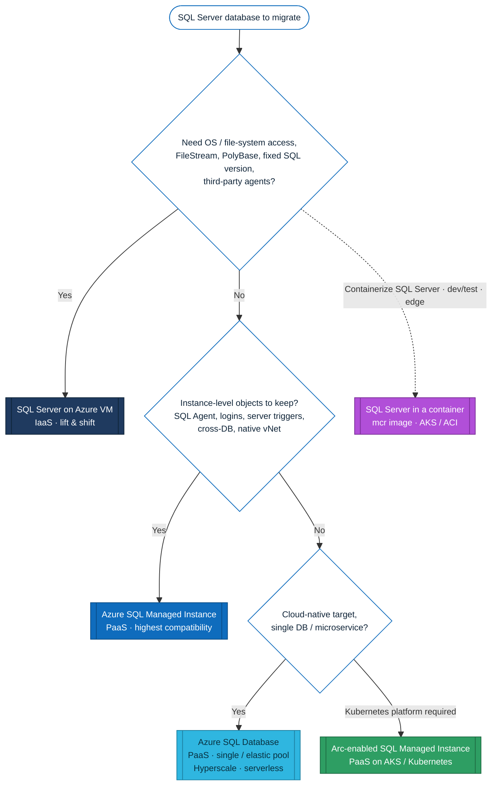
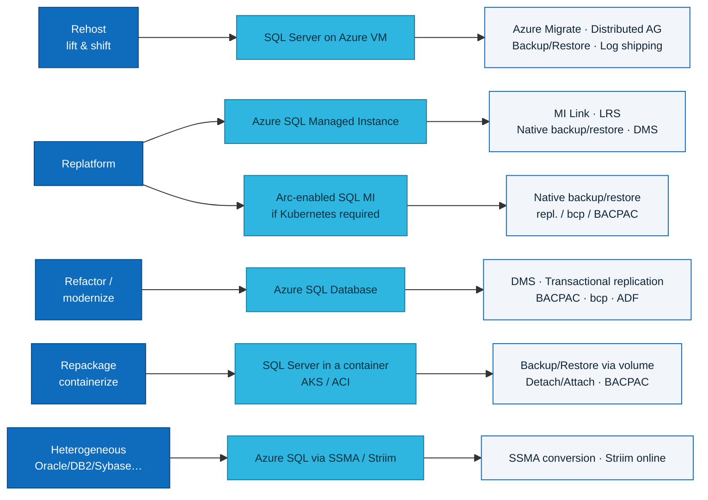

# Migrating SQL Server to Azure — exhaustive inventory of targets, methods and tools

> **Goal.** Exhaustively list every way and every tool to migrate a **SQL Server** database to **an Azure service** (all PaaS, including **containers**) or **an Azure VM**.
>
> **Verification.** Every target and method links to an official **Microsoft Learn** page (docs current as of 2026). The "container" sections rely on **Azure Arc-enabled SQL Managed Instance** (the SQL MI engine running on Kubernetes/AKS) and on the **SQL Server container image** (`mcr.microsoft.com/mssql/server`) — both documented. All links are gathered in [§8 Sources](#8-sources-microsoft-learn).

---

## 0. In one minute — which target should I choose?

**General rule (Microsoft Learn).** The consistent starting pair is **Azure Migrate** (discovery / assessment / sizing / business case) **+** **Azure Database Migration Service (DMS)** (managed migration), then the **data vehicle** that fits the target and the acceptable downtime window (MI Link, LRS, native backup/restore, distributed AG, etc.).

---

## 1. The Azure targets

| Target | Model | When to choose it | SQL Server compatibility | Official doc |
| --- | --- | --- | --- | --- |
| **Azure SQL Database** | PaaS — database | Cloud-native app / microservice; you accept dropping instance-level dependencies (SQL Agent…). Models: single DB / elastic pool; tiers **General Purpose / Business Critical / Hyperscale**; purchasing **vCore / DTU / serverless**. | Database surface (instance-level not supported) | [Migration overview](https://learn.microsoft.com/en-us/data-migration/sql-server/database/overview) |
| **Azure SQL Managed Instance** | PaaS — instance | Fewest application changes; keep logins, SQL Agent jobs, server triggers, cross-DB, **native vNet**. Tiers **GP / BC**. | ~Near-full (instance) | [Migration overview](https://learn.microsoft.com/en-us/data-migration/sql-server/managed-instance/overview) |
| **SQL Server on Azure VM** | IaaS | Faithful "lift & shift": OS / file-system control, exact SQL version, FileStream/FileTable, PolyBase, third-party agents. | Full (it *is* SQL Server) | [Migration overview](https://learn.microsoft.com/en-us/data-migration/sql-server/virtual-machines/overview) |
| **Azure Arc-enabled SQL Managed Instance** | PaaS **on Kubernetes / AKS** (containers) | Managed SQL MI engine running **in containers** on AKS, another cloud, the edge or on-prem — when the **Kubernetes** platform is mandated but you still want the MI experience. | ~Same as SQL MI | [Arc-enabled SQL MI](https://learn.microsoft.com/en-us/azure/azure-arc/data/create-sql-managed-instance) · [Arc data services](https://learn.microsoft.com/en-us/azure/azure-arc/data/overview) |
| **SQL Server in a container** (`mcr.microsoft.com/mssql/server` image) | Container on **AKS / ACI / Container Apps** | Full control of the SQL Server engine inside a container (dev/test, edge, custom deployments). Persistence via **Azure Disk** (AKS) or **Azure Files** (ACI). | Full (SQL Server on Linux binary) | [SQL Server on Kubernetes](https://learn.microsoft.com/en-us/sql/linux/quickstart-sql-server-containers-kubernetes) · [Docker container](https://learn.microsoft.com/en-us/sql/linux/quickstart-install-connect-docker) |

> **⚠️ Important — Arc-enabled SQL *Server* ≠ Arc-enabled SQL *Managed Instance*.**
> - **Azure Arc-enabled SQL Server** = **control plane / experience** (you "Arc-enable" an existing SQL Server for inventory, assessment, and to launch the migration from the portal). It is **not** a runtime target. → [Arc migration experience](https://learn.microsoft.com/en-us/sql/sql-server/azure-arc/migration-overview)
> - **Azure Arc-enabled SQL Managed Instance** = **containerized runtime target** (the SQL MI engine runs in pods on Kubernetes/AKS). → [Create Arc-enabled SQL MI](https://learn.microsoft.com/en-us/azure/azure-arc/data/create-sql-managed-instance)

---

## 2. Methods per target (verified on Microsoft Learn)

### 2.1 To **Azure SQL Database**

| Method | Online / Offline | Typical use |
| --- | --- | --- |
| [Azure Database Migration Service (DMS)](https://learn.microsoft.com/en-us/azure/dms/dms-overview) | Online + Offline | Recommended managed service, minimal downtime, at scale. |
| [Transactional replication](https://learn.microsoft.com/en-us/azure/azure-sql/database/replication-to-sql-database) | Online | Without taking the source DB out of production; can target a subset of tables/columns/rows (push subscription). |
| [Import/Export · BACPAC (SqlPackage)](https://learn.microsoft.com/en-us/azure/azure-sql/database/database-import) | Offline | Small/medium databases, single-DB; `SqlPackage` for scale. |
| [bcp / Smart Bulk Copy](https://learn.microsoft.com/en-us/sql/tools/bcp-utility) | Offline | **Data-only** / bulk migration, full or partial, volume-oriented. |
| [Azure Data Factory — Copy activity](https://learn.microsoft.com/en-us/azure/data-factory/connector-azure-sql-database) | Offline / batch | When the migration is also an integration / transformation (BI). |
| [PowerShell / Azure CLI](https://learn.microsoft.com/en-us/azure/azure-sql/database/single-database-create-quickstart) | Depends on engine | Industrialize / automate the right vehicle. |

> ❌ **Not supported for Azure SQL Database**: native `.bak` restore and detach/attach — those are MI/VM paths, not SQL DB.

### 2.2 To **Azure SQL Managed Instance**

| Method | Online / Offline | Typical use |
| --- | --- | --- |
| [Managed Instance link (MI Link)](https://learn.microsoft.com/en-us/azure/azure-sql/managed-instance/managed-instance-link-feature-overview) | **Online (near-zero downtime)** | Near real-time replication (distributed AG); target readable (R/O) during migration; cut over any time; mission-critical workloads. Sources SQL Server 2016→2022. |
| [Log Replay Service (LRS)](https://learn.microsoft.com/en-us/azure/azure-sql/managed-instance/log-replay-service-migrate) | Offline (planned downtime) | Full/diff/log backups pushed to Azure Blob; target DB stays in *restoring* until cutover; public endpoint. |
| [Native backup & restore (.bak)](https://learn.microsoft.com/en-us/azure/azure-sql/managed-instance/restore-sample-database-quickstart) | Offline | Simplest when the downtime of a full backup + restore is acceptable. |
| [Transactional replication](https://learn.microsoft.com/en-us/azure/azure-sql/managed-instance/replication-transactional-overview) | Online | Replicate all or part of the database (publisher/subscriber). |
| [bcp / Smart Bulk Copy](https://learn.microsoft.com/en-us/samples/azure-samples/smartbulkcopy/smart-bulk-copy/) | Offline | High-speed data-only / partial migrations (parallel copy). |
| [Import/Export · BACPAC](https://learn.microsoft.com/en-us/azure/azure-sql/database/database-import) | Offline | Smaller databases / simple migrations. |
| [Azure Data Factory — Copy activity](https://learn.microsoft.com/en-us/azure/data-factory/connector-azure-sql-managed-instance) | Offline / batch | Migration = integration / transformation project. |
| [SQL Server migration experience in Azure Arc](https://learn.microsoft.com/en-us/sql/sql-server/azure-arc/migrate-to-azure-sql-managed-instance) | Online / Offline | Once the source is **Arc-enabled**: assess + migrate to SQL MI from the portal (MI Link / LRS). |

### 2.3 To **SQL Server on Azure VM** (IaaS)

| Method | Online / Offline | Typical use |
| --- | --- | --- |
| [Azure Migrate](https://learn.microsoft.com/en-us/azure/migrate/migrate-services-overview) | Online (replication) | **Lift & shift** of the whole VM/instance (up to ~35,000 VMs), including **Failover Cluster Instance** and **Availability Group**. |
| [Distributed availability group](https://learn.microsoft.com/en-us/data-migration/sql-server/virtual-machines/overview) | **Online (minimal downtime)** | When an AG already exists on-prem; SQL Server 2016+. |
| [Backup to a file (.bak) + copy to Azure](https://learn.microsoft.com/en-us/data-migration/sql-server/virtual-machines/guide) | Offline | Simple, well-tested technique; supports > 1 TB; compression recommended. |
| [Backup to URL (Azure Blob)](https://learn.microsoft.com/en-us/sql/relational-databases/backup-restore/sql-server-backup-to-url) | Offline | Databases < 1 TB with good Azure connectivity (SQL 2014+). |
| [Detach & attach (MDF/LDF files via Azure Blob)](https://learn.microsoft.com/en-us/data-migration/sql-server/virtual-machines/guide) | Offline | Direct move of the data files. |
| [Log shipping](https://learn.microsoft.com/en-us/sql/database-engine/log-shipping/about-log-shipping-sql-server) | Minimal downtime | Continuous sync via log backups until cutover. |
| [Always On availability group](https://learn.microsoft.com/en-us/data-migration/sql-server/virtual-machines/availability-group-migrate) | Online | Fail over an existing AG onto replicas on Azure VM. |
| [Convert on-prem machine to Azure VM / Ship hard drive](https://learn.microsoft.com/en-us/azure/migrate/migrate-services-overview) | Offline | Large estates, limited bandwidth. |
| [DMS (within the Azure SQL flow)](https://learn.microsoft.com/en-us/azure/dms/dms-overview) | Scenario-dependent | Managed orchestration when the VM target is exposed in the guided flow. |

### 2.4 To **Azure Arc-enabled SQL Managed Instance** (containers / AKS)

This is the **SQL MI** engine running in **Kubernetes pods** (AKS or any cluster). Prerequisites: a K8s cluster + an **Arc data controller** deployed. → [Deployment](https://learn.microsoft.com/en-us/azure/azure-arc/data/create-sql-managed-instance)

| Method | Online / Offline | Typical use |
| --- | --- | --- |
| [Native backup & restore (.bak)](https://learn.microsoft.com/en-us/azure/azure-arc/data/migrate-to-arc-enabled-sql-managed-instance) | Offline | Restore a native SQL Server backup into the Arc MI instance. |
| [Point-in-time / restore to Arc MI](https://learn.microsoft.com/en-us/azure/azure-arc/data/migrate-to-arc-enabled-sql-managed-instance) | Offline | Per-database migration via managed restore on the Arc side. |
| Transactional replication / bcp / BACPAC / ADF | Online (repl.) / Offline | Same "logical" vehicles as SQL MI, since the target is a SQL MI endpoint. |

> Because Arc MI exposes a **SQL Managed Instance endpoint**, the logical data vehicles from [§2.2](#22-to-azure-sql-managed-instance) apply; the specificity is the **containerized hosting** on Kubernetes.

### 2.5 To **SQL Server in a container** (mcr image on AKS / ACI / ACA)

SQL Server runs in a Linux container; the database is persisted on **Azure Disk** (AKS) or **Azure Files** (ACI). → [SQL Server on Kubernetes/AKS](https://learn.microsoft.com/en-us/sql/linux/quickstart-sql-server-containers-kubernetes)

| Method | Online / Offline | Typical use |
| --- | --- | --- |
| [Backup / Restore (.bak via mounted volume)](https://learn.microsoft.com/en-us/sql/relational-databases/backup-restore/back-up-and-restore-of-sql-server-databases) | Offline | Standard path: `BACKUP DATABASE` on the source → `RESTORE` in the pod (Azure Files/Disk volume). |
| [Detach & attach (MDF/LDF on persistent volume)](https://learn.microsoft.com/en-us/sql/relational-databases/databases/database-detach-and-attach-sql-server) | Offline | Attach the data files inside the container. |
| BACPAC / bcp / ADF / Transactional replication | Offline / Online | Logical migration to the container's SQL endpoint (`,1433`). |

---

## 3. Tools & services — what, and what for

| Tool / service | Role | Targets | Online / Offline | Notes |
| --- | --- | --- | --- | --- |
| [Azure Migrate](https://learn.microsoft.com/en-us/azure/migrate/how-to-create-azure-sql-assessment) | Discovery / assessment / sizing / business case at scale | SQL DB · MI · VM | n/a (not a data mover) | Program kickoff; target/SKU/cost recommendations. |
| [Azure Database Migration Service (DMS)](https://learn.microsoft.com/en-us/azure/dms/dms-overview) | Managed migration orchestration service | SQL DB · MI · VM (Azure SQL flow) | Online + Offline | Core of managed execution (portal / PowerShell / CLI). |
| [Azure SQL Migration extension (Azure Data Studio)](https://learn.microsoft.com/en-us/azure-data-studio/extensions/azure-sql-migration-extension) | Front-end for assessment + DMS launch | SQL DB · MI · VM | Per vehicle | ⚠️ ADS being retired — capability consolidated into DMS / SSMS. |
| [SQL Server Migration Assistant (SSMA)](https://learn.microsoft.com/en-us/sql/ssma/sql-server-migration-assistant) | **Heterogeneous** conversion (schema/code/data) | Azure SQL | Scenario-dependent | For Oracle / Sybase / DB2 / MySQL / Access — **not** for homogeneous SQL→SQL. |
| [Data Migration Assistant (DMA)](https://learn.microsoft.com/en-us/sql/dma/dma-overview) | Assessment / remediation (legacy) | Azure SQL | n/a | Historical tool; superseded by the Azure Migrate / DMS experiences. |
| [Managed Instance link (MI Link)](https://learn.microsoft.com/en-us/azure/azure-sql/managed-instance/managed-instance-link-feature-overview) | Near real-time replication (distributed AG) | MI (+ Arc MI) | Online | Best minimum-downtime; target R/O during migration. |
| [Log Replay Service (LRS)](https://learn.microsoft.com/en-us/azure/azure-sql/managed-instance/log-replay-service-migrate) | Managed log-shipping to MI | MI | Offline | Full/diff/log backups → Azure Blob. |
| [Native backup & restore](https://learn.microsoft.com/en-us/azure/azure-sql/managed-instance/restore-sample-database-quickstart) | `.bak` restore | MI · VM · Arc MI · container | Offline | Simplest when downtime is acceptable. |
| [Transactional replication](https://learn.microsoft.com/en-us/azure/azure-sql/database/replication-to-sql-database) | Publisher/subscriber replication | SQL DB · MI | Online | Subsets possible; more complex setup. |
| [BACPAC / SqlPackage](https://learn.microsoft.com/en-us/azure/azure-sql/database/database-import) | Export/import schema + data | SQL DB · MI · container | Offline | Small/medium databases. |
| [bcp / Smart Bulk Copy](https://learn.microsoft.com/en-us/sql/tools/bcp-utility) | Data-only bulk load | SQL DB · MI · container | Offline | Volume / table-level; parallel copy. |
| [Azure Data Factory — Copy](https://learn.microsoft.com/en-us/azure/data-factory/connector-azure-sql-managed-instance) | Move/transform pipelines | SQL DB · MI | Offline / batch | When migration = integration. |
| [Distributed / Always On AG](https://learn.microsoft.com/en-us/data-migration/sql-server/virtual-machines/availability-group-migrate) | HA replication | VM | Online | Reuse an existing AG. |
| [PowerShell / Azure CLI](https://learn.microsoft.com/en-us/azure/azure-sql/) | Automation at scale | All | Per vehicle | Industrialize / CI-CD of migrations. |

**Third-party (verified in Microsoft sources).** The **Striim** partnership (FY26) covers **online** migrations SQL Server → Azure SQL (DB / MI / VM) and several heterogeneous pairs (Oracle, Sybase, DB2 → Azure SQL; MongoDB → Cosmos DB). Other vendors (Redgate, Quest, AWS SCT) exist but are not detailed here for lack of a verified official source.

---

## 4. Strategy mapping ("5 Rs") ↔ target ↔ method

---

## 5. Summary matrix — method / tool × target

| Method / tool | Azure SQL Database | Azure SQL MI | SQL Server on VM | Arc-enabled SQL MI (AKS) | SQL container (ACI/AKS) |
| --- | :---: | :---: | :---: | :---: | :---: |
| **Azure Migrate** (assess) | ✅ | ✅ | ✅ | ➖ | ➖ |
| **DMS** | ✅ | ✅ | ✅ (Azure SQL flow) | ➖ | ➖ |
| **MI Link** | ❌ | ✅ (online) | ❌ | ✅ | ❌ |
| **Log Replay Service** | ❌ | ✅ (offline) | ❌ | ➖ | ❌ |
| **Native backup/restore (.bak)** | ❌ | ✅ | ✅ | ✅ | ✅ |
| **Distributed / Always On AG** | ❌ | ❌ | ✅ (online) | ❌ | ❌ |
| **Log shipping** | ❌ | ➖ (LRS) | ✅ | ➖ | ➖ |
| **Detach / attach** | ❌ | ❌ | ✅ | ➖ | ✅ |
| **Transactional replication** | ✅ | ✅ | ✅ | ✅ | ✅ |
| **BACPAC / SqlPackage** | ✅ | ✅ | ✅ | ✅ | ✅ |
| **bcp / Smart Bulk Copy** | ✅ | ✅ | ✅ | ✅ | ✅ |
| **Azure Data Factory (Copy)** | ✅ | ✅ | ✅ | ✅ | ✅ |
| **SSMA** (heterogeneous) | ✅ | ✅ | ✅ | ✅ | ✅ |
| **SSMS / ADS migration UI** | ✅ | ✅ | ✅ | ➖ | ➖ |

Legend: ✅ supported / documented · ❌ not applicable · ➖ possible but not "first-class" / indirect.

---

## 6. Online vs Offline (cutover window)

```mermaid
%%{init: {'flowchart': {'nodeSpacing': 24, 'rankSpacing': 30}, 'themeVariables': {'fontSize': '12px'}}}%%
flowchart TB
    subgraph ON["🟢 Online · minimum downtime"]
        O1[MI Link]
        O2[Distributed / Always On AG]
        O3[Transactional replication]
        O4[Log shipping]
        O5[Striim &#40;third-party&#41;]
    end
    subgraph OFF["🟠 Offline · planned downtime"]
        F1[Native backup/restore]
        F2[Log Replay Service]
        F3[BACPAC / SqlPackage]
        F4[bcp / Smart Bulk Copy]
        F5[Detach / attach]
        F6[ADF Copy]
    end
    classDef on fill:#2E9E63,stroke:#1F6B43,color:#fff;
    classDef off fill:#E8A13A,stroke:#A86E18,color:#2a1c05;
    class O1,O2,O3,O4,O5 on;
    class F1,F2,F3,F4,F5,F6 off;
```

---

## 7. Decision grid (recommendations)

- **"Zero compatibility surprises"** → **SQL Server on Azure VM**. Start with **Azure Migrate** (inventory/assessment), then **backup/restore**, **distributed AG** or **DMS** depending on the cutover window.
- **"PaaS with the least pain"** → **Azure SQL Managed Instance**. Arbitrate **MI Link** (online) vs **LRS / native backup-restore** (offline). It's the best-documented target.
- **"Cloud-native / refactor"** → **Azure SQL Database**. Paths: **DMS**, **transactional replication**, **BACPAC/SqlPackage**, **bcp**, **ADF** — accepting remediation of instance-level dependencies.
- **"Kubernetes required"** → **Arc-enabled SQL Managed Instance** on AKS, migrated via **native backup/restore** + logical vehicles.
- **"Containerize SQL Server"** (dev/test, edge) → **`mcr` image** on **AKS/ACI**, migrated via **backup/restore over a persistent volume**.
- **"Heterogeneous source"** (Oracle/Sybase/DB2/MySQL) → **SSMA** (conversion) and/or **Striim** (online).

---

## 8. Sources (Microsoft Learn)

**Hubs & overviews**
- Database Migration (hub) — <https://learn.microsoft.com/en-us/data-migration/>
- SQL Server → Azure SQL Database — <https://learn.microsoft.com/en-us/data-migration/sql-server/database/overview>
- SQL Server → Azure SQL Managed Instance — <https://learn.microsoft.com/en-us/data-migration/sql-server/managed-instance/overview>
- SQL Server → SQL Server on Azure VM — <https://learn.microsoft.com/en-us/data-migration/sql-server/virtual-machines/overview>
- Azure SQL feature comparison — <https://learn.microsoft.com/en-us/azure/azure-sql/database/features-comparison>

**Tools / services**
- Azure Migrate (SQL assessment) — <https://learn.microsoft.com/en-us/azure/migrate/how-to-create-azure-sql-assessment>
- Azure Database Migration Service — <https://learn.microsoft.com/en-us/azure/dms/dms-overview>
- Managed Instance link — <https://learn.microsoft.com/en-us/azure/azure-sql/managed-instance/managed-instance-link-feature-overview>
- Log Replay Service — <https://learn.microsoft.com/en-us/azure/azure-sql/managed-instance/log-replay-service-migrate>
- Native backup & restore (MI) — <https://learn.microsoft.com/en-us/azure/azure-sql/managed-instance/restore-sample-database-quickstart>
- Transactional replication (SQL DB) — <https://learn.microsoft.com/en-us/azure/azure-sql/database/replication-to-sql-database>
- Import/Export · BACPAC — <https://learn.microsoft.com/en-us/azure/azure-sql/database/database-import>
- bcp utility — <https://learn.microsoft.com/en-us/sql/tools/bcp-utility>
- Smart Bulk Copy — <https://learn.microsoft.com/en-us/samples/azure-samples/smartbulkcopy/smart-bulk-copy/>
- Azure Data Factory (SQL MI connector) — <https://learn.microsoft.com/en-us/azure/data-factory/connector-azure-sql-managed-instance>
- SSMA — <https://learn.microsoft.com/en-us/sql/ssma/sql-server-migration-assistant>
- Data Migration Assistant (legacy) — <https://learn.microsoft.com/en-us/sql/dma/dma-overview>

**Containers & Azure Arc**
- Arc-enabled SQL Managed Instance — create — <https://learn.microsoft.com/en-us/azure/azure-arc/data/create-sql-managed-instance>
- Arc data services (overview) — <https://learn.microsoft.com/en-us/azure/azure-arc/data/overview>
- Migrate to Arc-enabled SQL MI — <https://learn.microsoft.com/en-us/azure/azure-arc/data/migrate-to-arc-enabled-sql-managed-instance>
- SQL Server migration experience in Azure Arc — <https://learn.microsoft.com/en-us/sql/sql-server/azure-arc/migration-overview>
- SQL Server on Kubernetes / AKS — <https://learn.microsoft.com/en-us/sql/linux/quickstart-sql-server-containers-kubernetes>
- SQL Server in a Docker container — <https://learn.microsoft.com/en-us/sql/linux/quickstart-install-connect-docker>
- Azure Container Instances (overview) — <https://learn.microsoft.com/en-us/azure/container-instances/container-instances-overview>

**VM — methods**
- Backup to URL — <https://learn.microsoft.com/en-us/sql/relational-databases/backup-restore/sql-server-backup-to-url>
- Availability group → Azure VM — <https://learn.microsoft.com/en-us/data-migration/sql-server/virtual-machines/availability-group-migrate>
- Detach & attach — <https://learn.microsoft.com/en-us/sql/relational-databases/databases/database-detach-and-attach-sql-server>
- Log shipping — <https://learn.microsoft.com/en-us/sql/database-engine/log-shipping/about-log-shipping-sql-server>

> *Links last verified: June 2026. Microsoft migration guides moved from `…/azure-sql/migration-guides/…` to `…/data-migration/sql-server/…` (redirects in place).*
