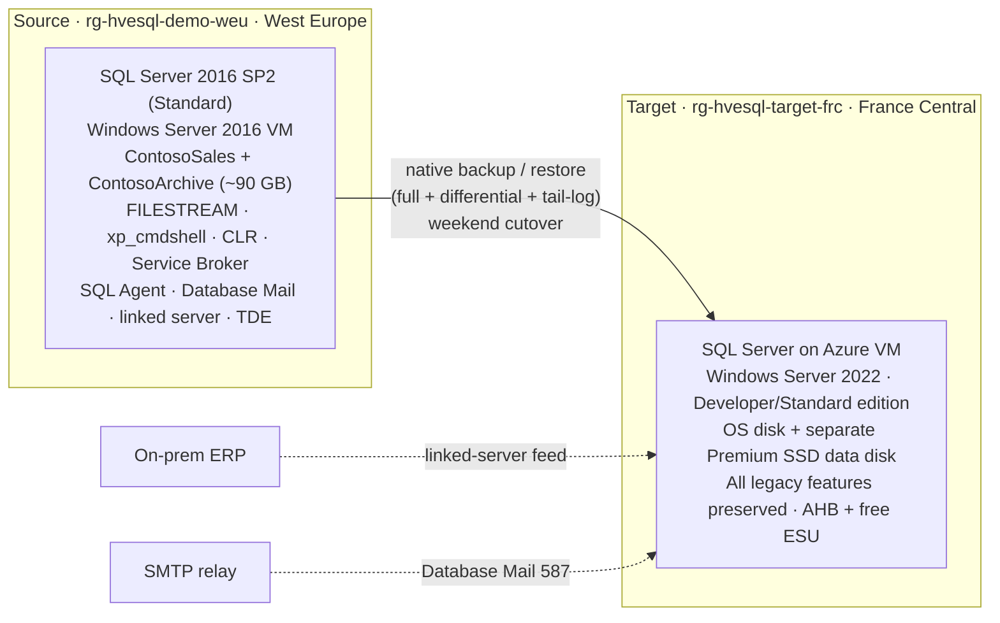

## What this lab is

This is the complete, end-to-end lab around `ContosoSales`. You start from nothing, deploy a real legacy SQL Server 2016 source, put on the field engineer (FDE) hat, and ask the HVE Squad to migrate it to Azure. The SQL Migration Advisor inside the squad runs a real interview, evaluates the workload, and lands on a **SQL Server on Azure Virtual Machine** target, a lift-and-shift **VM-to-VM** migration. From there, every squad role acts in turn, and the full HVE framework, the Research-Plan-Implement-Review spine, the council, the human gates, the scribe, and durable memory, is visible at each step.

This lab is written for you to *do*. It deploys the source, drives the advisor to the VM-to-VM answer, and walks each agent's contribution slowly enough to learn from.

### Learning objectives

By the end you will be able to:

* Deploy and seed a faithful legacy SQL Server 2016 workload on Azure.
* Trigger the squad and watch the coordinator route a SQL migration cue to the advisor.
* Read an advisor interview and explain *why* the workload lands on SQL Server on Azure VM rather than Managed Instance or Database.
* Attribute each migration artifact, cost, architecture, IaC, what-if, to a named squad role.
* Identify where the HVE framework enforces governance: the implementation gate, the council, and the Impactful-Action Gate.
* Produce a VM-to-VM cutover runbook that keeps every legacy feature working.

## The story in one paragraph

Contoso Distribution runs `ContosoSales` on SQL Server 2016 on an aging Windows VM. Extended support ends on **2026-07-14**, so the clock is real. The database is not portable: it uses `xp_cmdshell`, FILESTREAM, a CLR assembly, a linked server to an on-premises ERP, Service Broker, SQL Agent jobs, Database Mail, and TDE. The business wants the workload on Azure with the **least rework**, every operational feature intact, and a cutover that fits a single weekend. That combination is exactly what pushes the advisor away from a managed re-platform and toward a **rehost on a SQL Server Azure VM**.

## Why the target is SQL Server on Azure VM, not Managed Instance

This is the intellectual core of the lab, so understand it before you run it. Two of Contoso's dependencies are **hard blockers** for the managed targets:

| Dependency | Azure SQL Database | Azure SQL Managed Instance | SQL Server on Azure VM |
| --- | --- | --- | --- |
| `xp_cmdshell` (nightly file export) | Not supported | Not supported | **Supported** |
| FILESTREAM (scanned invoices) | Not supported | Not supported | **Supported** |
| CLR assembly (regional tax) | Not supported | Supported with restrictions | **Supported** |
| Linked server to on-prem ERP | Not supported | Supported | **Supported** |
| Service Broker | Not supported | Supported (in-instance) | **Supported** |
| SQL Agent jobs | Elastic Jobs only | Supported | **Supported** |
| Cross-database queries | Limited | Supported | **Supported** |
| Database Mail | Not supported | Supported | **Supported** |

The advisor skill encodes this directly: FILESTREAM (and FileTable, PolyBase, DTC) **eliminate SQL Database and SQL Managed Instance** and steer the target to VM, AVS, or a container. Choosing Managed Instance would force Contoso to re-engineer FILESTREAM into Blob Storage and replace `xp_cmdshell` with an Azure Function or Data Factory activity, application changes the migration constraints put **out of scope**. Rehosting on a SQL Server Azure VM preserves every feature with zero rework, and it adds a decisive cost lever for the deadline: **Extended Security Updates are free on Azure VMs**, while on-premises they are a paid subscription.

> [!NOTE]
> A rehost is not the "lazy" answer here. It is the answer the stated constraints produce. The advisor earns its place by reaching it through the interview instead of defaulting to a managed platform.

## Lab architecture at a glance



## Time, cost, and safety

* **Modules 0 and 1** deploy a real source VM, so they cost money while it runs. Deallocate it between sessions and delete it when you finish (see [Reset and cleanup](#reset-and-cleanup)).
* **Modules 2 through 5** are planning and advisory. They spend nothing. The target is validated with a what-if only, no managed resource is provisioned.
* **Every deploy stays behind the squad's Impactful-Action Gate.** Nothing reaches Azure without your explicit approval.

---

## Module 0 — Prerequisites and squad install

### 0.1 Prerequisites

You need, on your machine:

* Visual Studio Code with GitHub Copilot and Copilot Chat, agent mode enabled.
* The APM CLI on your path (it installs the squad).
* The Azure CLI (`az`) with Bicep support, and `az login` completed.
* PowerShell 7 or later (the source deploy and install scripts require it).
* Owner or Contributor on an Azure subscription you are willing to spend a small amount on.

> [!IMPORTANT]
> **Run this repository from a local, non-synced path** such as `C:\labs\FY27SQLMotion`. Do not keep it inside OneDrive, Dropbox, or any file-sync folder: `apm install` writes hundreds of skill files under `.agents/`, and a sync client locks them mid-write, so the install fails with `WinError 5 (access denied)`. A plain local path avoids this completely.

**Everything this lab needs is in this repository**, so it runs standalone:

* [../source-env/](../source-env/) — the Bicep, PowerShell scripts, and SQL that stand up and seed the legacy SQL Server 2016 source (Module 1).
* [../knowledge-docs/](../knowledge-docs/) — the inventory and constraints the advisor reads to reason about the target (Modules 2 and 3).
* This file — every `/squad` request is written inline in the module where you need it, so you never leave this page.

### 0.2 Get the lab

Clone the repository to a **local, non-synced path** (see the note above) and move into the lab folder:

```powershell
git clone https://github.com/fredgis/FY27SQLMotion.git C:\labs\FY27SQLMotion
cd C:\labs\FY27SQLMotion\lab
```

Everything from here runs from this `lab/` folder. Open it in VS Code (`code .`) so Copilot Chat and the squad operate on it.

### 0.3 Install the squad

Install the squad package into the lab folder:

```powershell
apm install "Peter-N91/hve-squad#v0.8.23"
```

### 0.4 Confirm the advisor is reachable

In Copilot Chat, agent mode:

```text
/squad request="List the roles available in the azure profile."
```

You should see the Azure cast plus `modernizer`. The optional Azure MCP wiring for the read-only governance beats is not required to complete this lab.

---

## Module 1 — Deploy and seed the legacy source

This module gives the advisor a real thing to inspect: a running SQL Server 2016 with the objects that drive the decision.

### 1.1 Find your public IP and accept the image terms

The RDP rule is scoped to a single source address you control. Find it, then confirm a valid SQL Server 2016 image for your region and accept its terms once:

```powershell
curl https://api.ipify.org
az vm image list --publisher MicrosoftSQLServer --offer SQL2016SP2-WS2016 --all --output table
az vm image terms accept --publisher MicrosoftSQLServer --offer SQL2016SP2-WS2016 --plan SQLDEV
```

### 1.2 Set the admin password and preview

The deploy script reads the VM administrator password from `SQLVM_ADMIN_PASSWORD` and never writes it to disk. Preview first, the script runs a what-if by default and creates nothing:

```powershell
$env:SQLVM_ADMIN_PASSWORD = '<a-strong-password-min-12-chars>'
./source-env/scripts/Deploy-SourceEnv.ps1 -AllowedRdpSourceAddressPrefix "<your-public-ip>/32"
```

### 1.3 Deploy for real

This lab deploys a live source. Review the what-if output, then create the resources:

```powershell
./source-env/scripts/Deploy-SourceEnv.ps1 -AllowedRdpSourceAddressPrefix "<your-public-ip>/32" -Deploy
```

The script asks you to type `DEPLOY` to confirm. It provisions a Windows Server 2016 VM with SQL Server 2016 SP2 into `rg-hvesql-demo-weu` in West Europe, reachable over RDP from your address only. SQL port 1433 is never exposed to the internet.

### 1.4 Install the ContosoSales database

SQL Server runs **on the VM**, and its port (1433) is never exposed to the internet, so you install the database **from the VM**, not from your workstation. `localhost` here means the VM's own SQL instance, so the scripts have to be on the VM first.

Get the VM's public IP (from the resource group you deployed to in 1.3):

```powershell
az vm list-ip-addresses -g rg-hvesql-demo-weu -o table
```

RDP into it, sharing your local drive so you can copy the scripts across:

```powershell
mstsc /v:<vm-public-ip>
```

Sign in as `contosoadmin` with the password you set. In the Remote Desktop dialog, before connecting, open **Local Resources -> More...** and tick **Drives**.

Now, **on the VM**, copy the `source-env` folder from your workstation and run the installer against the local instance:

```powershell
Copy-Item "\\tsclient\C\labs\FY27SQLMotion\lab\source-env" "C:\lab-source" -Recurse
cd C:\lab-source
.\scripts\Install-LegacyDatabase.ps1 -ServerInstance "localhost"
```

The VM administrator is a SQL `sysadmin` on the marketplace image, so Windows authentication works and `sqlcmd` is already present. The installer runs the three SQL scripts in order and leaves `ContosoSales` and `ContosoArchive` ready to inspect. Verify from the VM:

```powershell
sqlcmd -S localhost -E -Q "SELECT name FROM sys.databases WHERE name LIKE 'Contoso%'"
```

To install without RDP, use the `az vm run-command` method in [../source-env/README.md](../source-env/README.md#install-the-legacy-database).

### 1.5 What you just created

The installed objects are the evidence the advisor reasons from:

| Object | File | Why it matters to the migration |
| --- | --- | --- |
| `ContosoSales` + `ContosoArchive`, deprecated `text`/`ntext`/`image` columns | [../source-env/sql/01-create-legacy-db.sql](../source-env/sql/01-create-legacy-db.sql) | Cross-database dependency and legacy types |
| Seed data (~90 GB profile) | [../source-env/sql/02-seed-data.sql](../source-env/sql/02-seed-data.sql) | Realistic size for sizing and method choice |
| Service Broker, `xp_cmdshell` export proc, Database Mail proc, SQL Agent nightly close | [../source-env/sql/03-legacy-features.sql](../source-env/sql/03-legacy-features.sql) | The features that decide the target |

> [!IMPORTANT]
> Deallocate the VM when you pause: `az vm deallocate --resource-group rg-hvesql-demo-weu --name hvesql-demo-sql2016-vm`. A running VM accrues cost.

---

## Module 2 — Enter the FDE: open the migration request

Now you are the field engineer who owns the migration. Every `/squad` request you need is inline below, ready to copy.

### 2.1 Initialize the squad

```text
/squad profile=azure request="Set up the squad for a SQL Server to Azure migration project. Read ./knowledge-docs and ./source-env for context before proposing the cast."
```

The coordinator inspects the repository read-only, proposes the `azure` profile, and, on your confirmation, hands the roster to the **Squad Scribe** to seed `.copilot-tracking/squad/`. Watch the cast it names: `researcher`, `lead`, `developer`, `tester` (the methodology spine), plus `azure-architect`, `iac-author`, `deployer`, `asbuilt-author`, `azure-diagnose`, `architect`, `cost-manager`, `security`, and `modernizer`, the role that owns SQL migration advisory.

### 2.2 State the problem in the FDE's words

```text
/squad request="I need to migrate the ContosoSales SQL Server 2016 database to Azure before extended support ends on 2026-07-14. Act as the SQL migration advisor and run your assessment interview with me, one question at a time — ask me the questions, don't assume the answers — then give me the scored recommendation card."
```

The coordinator matches the `sql migration` routing pattern and dispatches `modernizer`, which resolves to the **Squad SQL Migration Advisor**. Crucially, you do **not** hand it the answers, no inventory files and no dependency dump. You ask it to *interview you*, which is what forces the advisor to run its questionnaire instead of pre-filling from a document. That interview is the next module.

> [!IMPORTANT]
> Do not point the advisor at `knowledge-docs/` or `source-env/sql` in this request. Those files contain the interview answers, and the advisor's rule is to pre-fill any answer you volunteer and only ask what is missing, so handing over the docs makes it jump straight to the recommendation and you lose the interview, the heart of the lab. Answer its questions live instead, using the table in Module 3 as your cheat-sheet.

---

## Module 3 — The advisor interview, the heart of the lab

The advisor does not guess. It fetches the FY27 SQL knowledge base as its source of truth, then asks a short interview one question at a time, and only then scores a recommendation. The questions pop up as multiple-choice prompts in VS Code; answer each from the table below. Here is the interview as it plays out for Contoso, with the answer you give and why each answer matters.

| # | Question | Contoso's answer | Effect on the decision |
| --- | --- | --- | --- |
| 1 | Scope | Single database (with a companion archive) | One recommendation, no estate discovery pass |
| 2 | Source location | On-premises / VM | Standard sources for backup/restore and Azure Migrate |
| 3 | Source version | 2016 | Meets every method gate; ESU deadline is the driver |
| 4 | Primary driver | End-of-support / ESU pressure | Time-boxed to the 2026-07-14 window |
| 5 | Management model | **Need OS / file-system / engine control** | `xp_cmdshell` and FILESTREAM need the OS, biases VM |
| 6 | Instance feature dependencies | **FILESTREAM**, CLR, cross-DB, linked servers, SQL Agent, Service Broker | FILESTREAM **eliminates SQL DB and SQL MI** |
| 7 | Largest database size | ~90 GB (150 GB band) | Comfortable for native backup/restore |
| 8 | Downtime tolerance | Minimal, a single weekend window | Offline-to-minimal method is acceptable |
| 9 | Network and ports | Standard WAN, can open outbound | Backup copy over the network is viable |
| 10 | Compliance / sovereignty | EU data boundary | Target stays in an EU region |
| 11 | Ancillary services | Many SQL Agent jobs, TDE-encrypted DBs | TDE cert-first; SQL Agent native on the target |

Applying the advisor's deterministic scoring, feature dependencies first, then management model, size, downtime, and sovereignty, produces this card.

### The recommendation card the advisor produces

> **Verdict — `ContosoSales`**
> **`SQL Server on Azure VM`** via **`native backup/restore`** · downtime **`minimal`** · grounded in the FY27 SQL knowledge base.

Contoso keeps `xp_cmdshell`, FILESTREAM, CLR, Service Broker, SQL Agent, and the ERP linked server working with zero rework, and a rehost gets **free Extended Security Updates** on Azure, which is the cheapest way to beat the 2026-07-14 deadline.

**📋 At a glance**

| | Recommendation |
| --- | --- |
| 🎯 **Target** | SQL Server on Azure VM (Windows Server 2022, Developer or Standard edition) |
| 🔁 **Method** | Native backup/restore (full + differential + tail-log); Azure Migrate for discovery and dependency mapping |
| ⏱️ **Downtime** | Minimal, a single controlled weekend cutover |
| 🧭 **Assess / orchestrate** | Azure Migrate (discovery + business case) → SSMS 22 Migration Component for validation |

**🚧 Blockers and fixes** (on a VM, the feature "blockers" become simple cutover steps)

* **TDE server certificate** → back up the certificate and private key on the source, restore it to the target VM **before** restoring the encrypted databases (order matters).
* **Linked server to the on-prem ERP** → re-establish the private network path (VPN or ExpressRoute) and recreate the linked-server definition from Azure.
* **Database Mail** → point the profile at a reachable SMTP relay and allow outbound 587.
* **`xp_cmdshell`, FILESTREAM, CLR, Service Broker, SQL Agent** → preserved on the VM, no rework, this is the reason VM beats a managed target here.

**🔌 Ancillary** — SQL Agent jobs → native on the VM · TDE → migrate the server certificate first.

**💰 Cost and program**

* **AHB** eligible for both Windows Server and SQL Server via Software Assurance · **ESU** free on Azure VM (paid via Arc on-premises).
* **Sizing:** capture Perfmon for at least 7 days and add ~20% headroom, never size from average CPU.
* **Programs:** SQL in a Day, Cloud Accelerate Factory / Azure Accelerate.

> ⚠️ **Biggest risk:** restoring the encrypted databases **before** the TDE certificate is in place, and undocumented linked servers or SQL Agent jobs surfacing at cutover. Defuse both by scripting the certificate export/import first and running an Azure Migrate dependency pass before the weekend.

🔗 *Microsoft Learn: migrate SQL Server to SQL Server on Azure Virtual Machines* · caveats: size the data disk for FILESTREAM growth.

> [!TIP]
> The single most valuable thing to narrate is the target choice and one reason for it. Read the verdict line aloud, then point at FILESTREAM in the interview table. That is the moment the advisor proves expertise.

---

## Module 4 — The squad delivers, agent by agent

With the card in hand, the coordinator runs the delivery methodology around it. Send each request in turn and watch a different named role own the outcome. This is where "the whole framework" is visible.

### 4.1 Cost Manager — price the target

```text
/squad request="Estimate the indicative monthly Azure cost for the recommended target: a SQL Server on Azure Virtual Machine (Standard_D4s_v3, Windows Server 2022 with SQL Server Developer/Standard edition) in France Central, with a 256 GB Premium SSD data disk plus the OS disk. Show the list price and the price with Azure Hybrid Benefit (Windows + SQL) applied, note that Extended Security Updates are free on Azure VMs, and add WAF cost-optimization recommendations including reserved instances."
```

The **Squad Cost Manager** returns an indicative monthly figure through the pricing path, shows the Azure Hybrid Benefit saving, and ties it to the avoided Extended Security Updates cost. Note the framework signal: it delegates live price lookups rather than inventing numbers.

### 4.2 Azure Architect — design the target

```text
/squad request="Design the HLD and LLD for the recommended SQL Server on Azure VM target in France Central: a private VNet and subnet, an NSG that allows RDP only from an admin CIDR and SQL 1433 only from the VNet (no public SQL endpoint), a Standard static public IP for RDP management only, a separate Premium data disk for SQL data/log and the FILESTREAM container, and Azure Hybrid Benefit licensing. Use Azure Verified Modules and a landing-zone-aligned layout."
```

The **Squad Azure Architect** emits a Mermaid HLD and an LLD resource table, and writes them to `target-env/HLD-LLD.md` **live**, the folder starts empty, so the design appears in front of you. Note France Central (West Europe compute is capacity-restricted on the lab subscription, and France Central preserves EU residency), the no-public-SQL-endpoint boundary, the separate data disk that keeps FILESTREAM on local NTFS, and Azure Hybrid Benefit modeled as a runtime toggle. Point out that the design reflects the advisor's VM target, not a generic template.

### 4.3 The spine gate — research and plan before code

The next request is implementation-tier, so before a line of Bicep is written the coordinator runs the **implementation gate**: the **Task Researcher** gathers module facts and the **Task Planner** sequences the work. Name this out loud, the code is planned and researched first, never written cold. This is the Research-Plan-Implement-Review spine that rides under every profile.

### 4.4 IaC Author — write the infrastructure

```text
/squad request="Author the Bicep for that LLD under target-env/infra/bicep using AVM modules where available, with a network module and a SQL-VM module, an Azure Hybrid Benefit toggle, and a parameterized admin RDP CIDR. Do not deploy."
```

The **Squad IaC Author** writes the target Bicep to `target-env/infra/bicep` **live**, a network module and a SQL-VM module authored in front of you into the empty folder. Inspect two framework-relevant choices in the output: the NSG never opens 1433 to the internet, and Azure Hybrid Benefit is a `bool` parameter, not a hardcoded value, because licensing is a commercial fact confirmed with the customer.

### 4.5 Optional — convene the council

```text
/squad request="Convene a pre-implementation council on the target-env Bicep and the migration plan: architecture, security, cost, and product-fit. Give me a go / no-go with conditions."
```

The coordinator dispatches `architect`, `security`, `cost-manager`, and `product-owner` in parallel. Each returns a verdict (`Approve`, `Conditional`, `Concern`, `Block`) and a risk label. The Scribe synthesizes them with a **most-restrictive-wins** rule and writes a single Council Verdict to `decisions.md`. This is the framework's pre-implementation cross-check, and its verdict gates the next dispatch.

### 4.6 Deployer — what-if, then the gate

```text
/squad request="Run a deployment what-if for the target-env Bicep against a new resource group rg-hvesql-target-frc in France Central. Do not create anything. Show me the predicted changes and any policy concerns, then stop for my approval."
```

The **Squad Deployer** runs a read-only policy precheck and a what-if, then **stops at the Impactful-Action Gate**. Do not approve. The pause is the lesson: the squad is autonomous right up to the point where it would spend money or change a subscription, and there it waits for a human. This is the governance beat.

### 4.7 As-Built and Diagnose — read-only value after the deploy

Point these at a resource group you already own so they produce real output with zero spend.

```text
/squad request="Produce an as-built for resource group <your-existing-rg>: a resource inventory, a compliance matrix from Azure Policy state, an operations runbook, and a backup and DR plan. Read-only."
```

```text
/squad request="Diagnose the health of resource group <your-existing-rg>. Rank hypotheses from Resource Health, Azure Monitor, and Resource Graph, and recommend remediations without applying anything."
```

The **As-Built Author** and **Azure Diagnose** roles are strictly read-only. They show the squad keeps adding value after a deploy, on infrastructure that already exists.

---

## Module 5 — The VM-to-VM cutover runbook

The squad plans, prices, and validates. The actual cutover is a runbook a human executes in the weekend window. Because the target is a SQL Server VM, the runbook preserves every feature. Order matters most for the encryption certificate.

1. **Pre-cutover (days before).** Run an Azure Migrate dependency pass to surface every linked server and SQL Agent job. Capture Perfmon for at least 7 days for sizing. Provision the target VM from the validated Bicep (this is the gated deploy, approved deliberately).
2. **Back up the TDE certificate first.** On the source, back up the server certificate and its private key. Restore it to the target instance **before** any encrypted database. Skipping this order is the single most common cause of a failed restore.
3. **Seed with a full backup.** Take a full backup of `ContosoSales` and `ContosoArchive`, copy it to the target's data disk, and restore it. The FILESTREAM filegroup restores onto local NTFS on the separate Premium data disk, no Blob migration.
4. **Narrow the gap with differentials/logs.** Take differential and log backups up to the cutover, and restore them on the target to keep downtime inside the window.
5. **Cutover (the weekend window).** Stop the application, take a tail-log backup, restore it, and recover the databases on the target.
6. **Re-establish the instance-level features.** Recreate or migrate SQL Agent jobs (including the nightly close), enable Service Broker, recreate the ERP linked server against the re-established network path, and point Database Mail at the SMTP relay with outbound 587 open. `xp_cmdshell` and the CLR assembly work as-is.
7. **Validate and switch.** Run a smoke test of the nightly close and the ordering/invoicing message flow, then repoint the application connection string to the target and monitor.

> [!NOTE]
> This runbook is the "faire la migration" step of the lab. The squad produces the plan and the IaC; you execute the cutover against the source you deployed in Module 1 if you choose to take the lab all the way through.

---

## Module 6 — One-line autopilot variant

To see the squad sequence the whole pipeline from a single line instead of running Modules 2 through 4 by hand:

```text
/squad profile=azure mode=autopilot request="Plan the migration of the ContosoSales SQL Server 2016 database to Azure before extended support ends on 2026-07-14. Read ./knowledge-docs and ./source-env for context. I need a target recommendation with migration method and downtime class, the blockers with remediations, an indicative monthly cost with Azure Hybrid Benefit, an HLD and LLD, and the target Bicep authored under target-env/. Run a deployment what-if but do not deploy. Keep me in control of anything that spends money or changes my subscription."
```

Autopilot sequences research, plan, council, implement, and review by itself, and stops at the gate. If the review gate finds an unremediated blocker, for example the TDE certificate order left unaddressed, it escalates instead of shipping. That escalation is a feature; read it out loud.

## Module 7 — Hand it to the cloud coding agent

The same work can run without you at the keyboard. Open [../copilot/coding-agent-task.md](../copilot/coding-agent-task.md), paste its body into a GitHub issue in your fork, and assign the issue to the GitHub Copilot coding agent. It follows the same guardrails, plans, prices, authors the target IaC, runs a what-if only, and returns a pull request. Review that pull request as the closing beat.

---

## Reset and cleanup

The source VM costs money, and the squad writes generated files. To reset:

```powershell
# Stop the source VM between sessions
az vm deallocate --resource-group rg-hvesql-demo-weu --name hvesql-demo-sql2016-vm

# Tear the source environment down when finished
az group delete --name rg-hvesql-demo-weu --yes --no-wait
```

To rerun the squad cleanly, discard the generated planning artifacts under `.copilot-tracking/squad/` and any regenerated files under `target-env/` with version control, leaving `source-env/`, `knowledge-docs/`, and `docs/` untouched.

## What the HVE framework demonstrated

| Framework element | Where you saw it | What it proved |
| --- | --- | --- |
| SQL Migration Advisor | Module 3 interview and card | Expertise: the right target reached by reasoning, not defaulting |
| Coordinator routing | Module 2.2 SQL cue → `modernizer` | The request reached the right specialist automatically |
| Research-Plan-Implement-Review spine | Module 4.3 gate before IaC | Code is planned and researched, never written cold |
| Council (most-restrictive-wins) | Module 4.5 | A pre-implementation cross-check that gates the next step |
| Impactful-Action Gate | Module 4.6 what-if stop | Autonomy up to spend, then a human decides |
| Squad Scribe and memory | `decisions.md`, `history/`, `/memories/repo/` | A durable, auditable record of every decision |
| Read-only roles | Module 4.7 as-built and diagnose | Value continues after the deploy, at zero spend |

## Troubleshooting and FAQ

* **The advisor recommended Managed Instance, not VM.** It was probably not given the FILESTREAM and `xp_cmdshell` dependencies, or it was told to remediate them. Re-run Module 2.2 and make sure the request points at `legacy-inventory.md` and `source-env/sql`, where those dependencies live.
* **"Why not Managed Instance?"** Because FILESTREAM and `xp_cmdshell` are unsupported there, and remediating them is application rework the constraints put out of scope. See the comparison table above.
* **The what-if reports image or capacity errors.** Confirm a valid image SKU and region with `az vm image list`, and remember the target uses France Central because West Europe compute is capacity-restricted on the lab subscription.
* **The squad tried to deploy.** It should not. If a role proposes an apply, the Impactful-Action Gate must stop it for your approval. Decline, and report it, that pause is the product.
