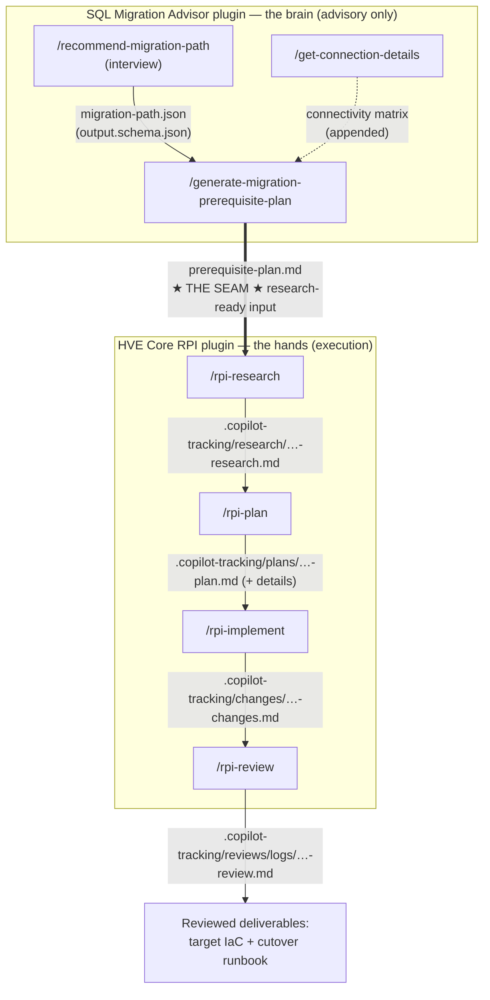

## What this lab is

This is the **pure hve-core** rewrite of [the VM-to-VM squad lab](./04-lab-vm-to-vm.md). Same story, same `ContosoSales` workload, same target — but the orchestration layer is gone and the install is **two native GitHub Copilot plugins**. There is **no HVE Squad** and **no APM** anywhere. You install the intelligence with `/plugin`, then call its skills in order.

The two building blocks — both installed as GitHub Copilot plugins:

1. **The SQL Migration Advisor** ([fredgis/sql-migration-advisor](https://github.com/fredgis/sql-migration-advisor)) — the migration **brain**. A versioned Copilot plugin that installs **three skills** (`recommend-migration-path`, `generate-migration-prerequisite-plan`, `get-connection-details`). They interview you, pick the **migration path**, and emit a machine-readable **prerequisite plan**. The brain is advisory only: it never authors infrastructure and never deploys.
2. **HVE Core RPI** ([microsoft/hve-core](https://github.com/microsoft/hve-core)) — the migration **hands**. A Copilot plugin that installs the Research → Plan → Implement → Review workflow: the direct phase skills `/rpi-research`, `/rpi-plan`, `/rpi-implement`, `/rpi-review`, coordinated end-to-end by the **RPI Agent** (`/agent hve-core:rpi-agent`). It takes the brain's plan as input and executes the migration.

**The one idea this lab exists to show:** the brain decides *what* to migrate and *how*; RPI disciplines *how you execute* it — and **every hand-off between the two, and between every RPI phase, is a file, not a conversation.** That file chain is "the glue," and this lab makes it visible at every hop.

> [!NOTE]
> **Why do this instead of the squad lab?** To see the framework with the orchestration layer removed. In the squad lab a coordinator routes the SQL cue, runs the council, and holds the gates for you. Here **you are the coordinator**: you install two plugins, call the skills in order, and carry each artifact forward by hand. It is more manual — and that is the point. The path, the plan, the RPI phases, and the files that connect them are all in the open. It also runs on `hve-core` + one small plugin, without the ~290-dependency squad.

> [!NOTE]
> **CLI-first.** This lab is written for the **GitHub Copilot CLI** (`copilot`), because that is where `/plugin` and the `copilot plugin …` commands live, and it matches how the demo is recorded. Every step also works in VS Code with the Copilot Chat extension — where noted, the VS Code equivalent is called out.

### Learning objectives

By the end you will be able to:

* Install HVE Core **and** the migration brain as **two GitHub Copilot plugins** — no APM, no squad.
* Run the Advisor interview yourself and produce a **migration path** and a **prerequisite plan** as durable artifacts.
* Hand that plan to HVE Core **RPI** as research-ready input and drive `/rpi-research → /rpi-plan → /rpi-implement → /rpi-review`.
* **Name every seam in the chain** — for each hand-off, say which skill produced it, which file carries it, which contract validates it, and which skill consumes it next.
* Explain precisely where the brain stops (advisory) and where RPI takes over (execution), and why the boundary is deliberately a file.

## The glue in one picture

Read this diagram as a pipeline of **files**. Every box is a skill; every arrow is a named artifact on disk. There is no arrow that is "just a chat message."



**Every labelled edge is a file you can open.** A hand-off described only in prose can drift between two people or two agents; a hand-off that is a *validated artifact* — schema-checked JSON, a templated Markdown plan, a dated tracking doc — cannot. That is why this lab keeps pointing at the files.

## Time, cost, and safety

* **Track A (core)** — install the two plugins, run the three Advisor skills and the four RPI skills through to authored IaC and a runbook. **Zero Azure spend, no VM.** ~45–60 min.
* **Track B (optional)** — deploy the real SQL Server 2016 source from [`../source-env/`](../source-env/) so `/rpi-implement` has something live to point a `what-if` at. Costs money while the VM runs.
* `/rpi-implement` authors artifacts and, at most, runs `what-if`. **Nothing is deployed to Azure** without your explicit approval; RPI's own review phase is your gate.

---

## Module 0 — Install the two plugins (Track A · ~10 min · $0)

The whole install is: get the lab folder, then install two GitHub Copilot plugins. No `apm install`, no squad.

### 0.1 Prerequisites

* **GitHub Copilot CLI** installed and authenticated (`copilot`). *(VS Code with the Copilot Chat extension works too — use `/plugin` in chat instead of the terminal commands.)*
* `git`.
* PowerShell 7+.
* The Azure CLI (`az`) with Bicep — only needed for Track B and for a real `what-if`; `az login` if you use it.

### 0.2 Get the lab (your working directory)

```powershell
git clone https://github.com/fredgis/FY27SQLMotion.git C:\labs\FY27SQLMotion
cd C:\labs\FY27SQLMotion\lab
copilot   # start a GitHub Copilot CLI session in this folder
```

> [!NOTE]
> **Do you actually need this clone?** Yes — but only this one. The two *engines* are plugins (below), so you do **not** clone `hve-core` or `sql-migration-advisor`. You clone the lab because it is your **working directory and your scenario**:
> * `knowledge-docs/` holds the ContosoSales facts — the "answer key" you read from during the interview (and, per the note in Module 2, deliberately do **not** hand to the advisor).
> * `target-env/` is where the advisor's artifacts land (cwd-relative, under `lab/`). RPI's `.copilot-tracking/` lands at the **git repo root** (one level up from `lab/`) — see the note in Module 4.
> * `source-env/` is the optional Track B source deployment.
> * In the **CLI**, path-specific instructions are auto-applied only from **this repo's** `.github/instructions/` (see [§0.5](#05-optional-but-recommended-enable-applyto-instructions-in-the-cli)) — a plugin cannot auto-apply them for you.
>
> Run everything from inside `C:\labs\FY27SQLMotion\lab`; that folder root is where RPI writes `.copilot-tracking/`.

### 0.3 Install HVE Core (the RPI engine)

Register the marketplace, then install the plugin. The one `hve-core` plugin includes the complete RPI lifecycle (agents, phase skills, prompts).

```powershell
copilot plugin marketplace add microsoft/hve-core
copilot plugin install hve-core@hve-core
```

> [!TIP]
> `microsoft/hve-core` is the development tip (`main`). For a reviewed, pinned channel use `microsoft/hve-core#release/stable` (or an exact tag `microsoft/hve-core#v<version>`) instead — then install the same way. This lab is written against the `main` skill names (`rpi-*`).

### 0.4 Install the SQL Migration Advisor (the migration brain)

Same mechanism — a second plugin. It installs the three migration skills (discovered from the repo's `skills/`, no manifest needed).

```powershell
copilot plugin marketplace add fredgis/sql-migration-advisor
copilot plugin install sql-migration-advisor@fredgis
```

> [!NOTE]
> Installing from a marketplace opens an interactive picker, so run these from a real terminal or from `/plugin` inside a Copilot session. A single-command form also works: `copilot plugin install fredgis/sql-migration-advisor`. Keep it current with `copilot plugin update sql-migration-advisor` — the plugin is versioned (`v3.1.1`+) and its rule set is refreshed by a weekly KB check.

### 0.5 (Optional) Force `applyTo` instructions in the CLI

**You do not need this to run the lab.** In a real end-to-end run, the chain (research → plan → implement → review) produced correct, convention-aligned Bicep and PowerShell — validated with `az bicep build` — *without* this step. Do it only if you want the CLI to auto-apply hve-core's `applyTo` instruction files (Bicep / PowerShell / Markdown conventions) as an extra guardrail while RPI edits files.

The nuance it addresses: in the CLI, plugins expose agents, commands, and skills — but instructions are auto-applied only from *your project's own* `.github/instructions/`, not from a plugin. If you want that strict enforcement, copy the hve-core instruction set into the lab once. Find where the plugin is installed first:

```powershell
copilot plugin list --verbose    # shows the on-disk path of the hve-core plugin
# then copy its .github/instructions/{coding-standards,hve-core,shared}/* into .github\instructions\
```

Skip this in **VS Code**: the Copilot Chat extension applies plugin instructions by `applyTo` automatically, so nothing to copy.

### 0.6 Verify the surface

Inside the `copilot` session:

* `/plugin` — lists **hve-core** and **sql-migration-advisor** as installed.
* Typing `/` shows the RPI phase skills **`/rpi-research`, `/rpi-plan`, `/rpi-implement`, `/rpi-review`**, and the Advisor skills **`/recommend-migration-path`, `/generate-migration-prerequisite-plan`, `/get-connection-details`**.
* `/agent hve-core:rpi-agent` switches into the coordinated RPI lifecycle (the one-line variant in Module 6). *(In VS Code this is the **RPI Agent** in the picker, or `/rpi`.)*

> [!NOTE]
> **What you get from hve-core, and what you don't.** hve-core gives you the *methodology* — the RPI phase skills, the RPI Agent that coordinates them, its subagents (`RPI Researcher`, `RPI Planner`), the validators, and the generic security/architecture/markdown/PowerShell/Bicep instructions. It contains **no SQL migration expertise at all.** That is exactly the core boundary: hve-core is the disciplined execution spine; the domain brain is the *other* plugin. Remove the Advisor and RPI still runs — but it would plan a generic migration with no SQL knowledge.

---

## Module 1 — (Optional, Track B) Deploy and seed the legacy source

Identical to the squad lab. Deploy this only if you want a live database for `/rpi-implement` to point a `what-if` at. To stay on Track A, skip to Module 2 — the Advisor and RPI reason from [`../knowledge-docs/`](../knowledge-docs/), not from a live server.

```powershell
$env:SQLVM_ADMIN_PASSWORD = '<a-strong-password-min-12-chars>'
./source-env/scripts/Deploy-SourceEnv.ps1 -AllowedRdpSourceAddressPrefix "<your-ip>/32" -Deploy
```

See [Module 1 of the squad lab](./04-lab-vm-to-vm.md#module-1--deploy-and-seed-the-legacy-source) for the full walkthrough, including the RDP-free install and the region-capacity notes.

---

## Module 2 — Brain, skill 1: the interview and the migration path (Track A · ~15 min · $0)

Now you play the field engineer. The brain does not guess: it fetches the FY27 SQL knowledge base as its source of truth, asks a short interview **one question at a time**, and only then scores a recommendation. Invoke the skill:

```text
/recommend-migration-path

Assess the ContosoSales SQL Server 2016 database for migration to Azure. Run your interview
one question at a time, don't assume the answers, then give me the recommended migration path.
```

> [!IMPORTANT]
> **Answer the interview live — do not hand over the docs.** Do not point the advisor at `knowledge-docs/` or `source-env/sql` in this request. Those files contain the interview answers, and the advisor pre-fills any answer you volunteer and only asks what is missing — so handing over the docs makes it jump straight to the recommendation and you lose the interview, the heart of the lab. Answer each question yourself from the cheat-sheet below.

> [!NOTE]
> **Interactive vs scripted.** In an interactive `copilot` session the interview really is one question at a time — that is the experience to show. In non-interactive/scripted mode (`copilot -p …`) the agent cannot stop to ask, so you supply all the answers up front in the prompt and it scores the path in one pass. Both reach the same path object; only the pacing differs.

### The interview cheat-sheet (Contoso's answers, and why each matters)

| # | Question | Contoso's answer | Effect on the decision |
| --- | --- | --- | --- |
| 1 | Scope | Single database (with a companion archive) | One recommendation, no estate-discovery pass |
| 2 | Source location | On-premises / VM | Standard sources for backup/restore and Azure Migrate |
| 3 | Source version | 2016 | Meets every method gate; the ESU deadline is the driver |
| 4 | Primary driver | End-of-support / ESU pressure | Time-boxed to the 2026-07-14 window |
| 5 | Management model | **Need OS / file-system / engine control** | `xp_cmdshell` and FILESTREAM need the OS → biases VM |
| 6 | Instance feature dependencies | **FILESTREAM**, CLR, cross-DB, linked servers, SQL Agent, Service Broker | FILESTREAM **eliminates SQL DB and SQL MI** |
| 7 | Largest database size | ~90 GB (150 GB band) | Comfortable for native backup/restore |
| 8 | Downtime tolerance | **OFFLINE — a single planned weekend maintenance window (hours, not minutes)** | Selects an **OFFLINE** cutover class → **native backup/restore**. ⚠️ If you answer just "minimal", the advisor may read it as minutes and pick **log shipping** instead — see the note below |
| 9 | Network and ports | Standard WAN, can open outbound | Backup copy over the network is viable |
| 10 | Compliance / sovereignty | EU data boundary | Target stays in an EU region |
| 11 | Ancillary services | Many SQL Agent jobs, TDE-encrypted DBs | TDE cert-first; SQL Agent runs native on the target |

Applying the advisor's deterministic scoring — feature dependencies first, then management model, size, downtime, and sovereignty — produces this card:

> **Verdict — `ContosoSales`**
> **`SQL Server on Azure VM`** via **`native backup/restore`** · downtime **`OFFLINE`** · grounded in the FY27 SQL knowledge base.

* **🎯 Target** — SQL Server on Azure VM (Windows Server 2022, Developer or Standard edition), because FILESTREAM + `xp_cmdshell` + "need OS control" eliminate SQL DB and SQL MI.
* **🔁 Method** — native backup/restore (full + differential + tail-log); Azure Migrate for discovery and dependency mapping.
* **⏱️ Downtime** — OFFLINE, a single controlled weekend cutover.
* **🚧 Blockers become cutover steps** — TDE server certificate (restore it to the target **before** the encrypted databases); the ERP linked server (re-establish the private path, recreate the definition); Database Mail (point at a reachable SMTP relay, allow outbound 587); `xp_cmdshell`/FILESTREAM/CLR/Service Broker/SQL Agent all **preserved on the VM, no rework** — the reason VM beats a managed target here.
* **💰 Cost/program** — AHB eligible for Windows + SQL via Software Assurance; **ESU free on Azure VM**; size from ≥7 days of Perfmon + ~20% headroom, never from average CPU.

> [!IMPORTANT]
> **Why the downtime answer must say "OFFLINE" (question 8).** The advisor scores the *method* partly from the downtime class. If you answer question 8 with just "minimal", the advisor can read it as a *minutes-level* cutover and recommend **log shipping** as the primary method (native backup/restore drops to the alternative). The target stays `SQL Server on Azure VM` either way, but to reproduce the card above — and the rest of this lab, whose Module 4 prompt is written around native backup/restore — answer question 8 as an **OFFLINE weekend maintenance window measured in hours, not minutes**. This is a genuine ambiguity in how "minimal" is worded, not a bug: state the cutover class explicitly.

The skill emits this result as a **migration path object** conforming to `skills/recommend-migration-path/schemas/output.schema.json`. In the current v3.1 schema the object's top-level keys are `metadata`, `normalizedProfile`, `eligibilityTrace` (every candidate target with a rule id and reason), `recommendation`, `alternative`, `methodCandidates`, `methodGateTrace`, `blockers`, `unknowns`, `assumptions`, `evidenceRequired`, `nextActions`, `evidenceLinks`, and `largestRisk` — with the downtime class carried as `normalizedProfile.downtime` (here `OFFLINE`).

> [!NOTE]
> **The skill does not pretend to be certain.** When you withhold facts (exact source OS/edition, blob HTTPS reachability, region), the live skill returns `metadata.recommendationStatus = "provisional"` with `confidence = "low"`, a `methodGateTrace.result` of `unknown_requires_assessment`, an empty `blockers` array (on a VM the feature "blockers" become cutover steps), and a populated `evidenceRequired` list. That honesty is the point — it names what must still be proven rather than guessing. The target/method are firm; the *readiness* is explicitly provisional until the unknowns close.

> [!IMPORTANT]
> **★ Glue (hand-off #1) ★** This object is the brain's canonical output, not just prose in the chat. The *next* skill consumes it, so persist it to a file:
>
> ```text
> Save the recommended migration path object to target-env/migration-path.json.
> ```
>
> **Producer:** `/recommend-migration-path` · **Artifact:** `target-env/migration-path.json` · **Contract:** `recommend-migration-path/schemas/output.schema.json` · **Consumer:** `/generate-migration-prerequisite-plan` (Module 3). A schema-validated file can be checked; a hand-off that lives only in the conversation cannot.

📄 **What you get from Module 2 — `target-env/migration-path.json`.** A machine-readable *decision record*: the recommended **target** and **method**, the **downtime class**, the full **eligibility trace** (why each candidate target was kept or ruled out), the **method candidates**, **blockers**, **unknowns**, **evidence still required**, and the **cost/funding levers**. It is not a design and not code — it is the sourced verdict the next skill turns into a checklist. Keep it; Module 3 reads it by path.

---

## Module 3 — Brain, skill 2: turn the path into a prerequisite plan (Track A · ~10 min · $0)

The second skill, `generate-migration-prerequisite-plan`, reads the path object and produces the **prerequisite plan** — the readiness checklist RPI will execute against. This is the artifact that makes the whole migration RPI-drivable.

```text
/generate-migration-prerequisite-plan

Use the migration path in target-env/migration-path.json. Produce the prerequisite plan and
write it to target-env/prerequisite-plan.md.
```

The skill reads the path, applies its prerequisite knowledge base (`skills/generate-migration-prerequisite-plan/reference/*.json`), and writes a plan shaped like its [`prerequisite-plan.md` template](https://github.com/fredgis/sql-migration-advisor/blob/main/skills/generate-migration-prerequisite-plan/templates/prerequisite-plan.md), conforming to that skill's `schemas/output.schema.json`:

* an **overall readiness verdict** (`READY` / blockers missing / unknowns),
* a **readiness summary** table by area,
* a **prerequisites table** — each requirement with a status (`✅ confirmed / ❌ missing / ❓ unknown / ➖ n/a`), whether it is **blocking**, an **owner**, the **evidence required**, and an **official source**,
* **blocking actions**, **remaining unknowns**, **inherited advisor facts/assumptions**, and **next actions**.

Optionally enrich the plan with connectivity facts (ports, private paths, the TDE-cert order) from the third skill:

```text
/get-connection-details

Target: SQL Server on Azure VM, with a linked server to an on-prem ERP and Database Mail.
Append the connectivity matrix to target-env/prerequisite-plan.md.
```

> [!IMPORTANT]
> **★ Glue (hand-offs #2 and #3) ★**
> **#2** — Producer: `/generate-migration-prerequisite-plan` · Artifact: `target-env/prerequisite-plan.md` · Contract: that skill's `schemas/output.schema.json` + `templates/prerequisite-plan.md` · Consumer: `/rpi-research` (Module 4).
> **#3** — Producer: `/get-connection-details` · Artifact: the connectivity matrix appended into `prerequisite-plan.md` · Contract: `get-connection-details/reference/connectivity-matrix.json` · Consumer: `/rpi-research`.

📄 **What you get from Module 3 — `target-env/prerequisite-plan.md`.** The *readiness checklist* — the partner-facing deliverable. It carries an overall verdict (e.g. `unknown_requires_assessment`), a readiness summary by area, and a **prerequisites table** where every requirement has a **status**, whether it **blocks**, an **owner**, the **evidence required**, and an **official source** — followed by **blocking actions** and **remaining unknowns**. This is the polished Markdown you can export to a PDF and hand to the customer, and it is the exact artifact RPI executes against next. (If you ran `/get-connection-details`, a connectivity matrix — ports, private paths, TDE-cert order — is appended to the same file.)

> [!NOTE]
> Notice what the brain **never** does: it never authors Bicep, never runs a backup, never deploys. Every prerequisite carries an **owner**, **evidence required**, and a **status** — deliberately the vocabulary of an *executable plan*, not a design. The brain has produced a **plan of record**. Executing it is RPI's job.

---

## Module 4 — The seam: hand the plan to RPI (Track A · ~5 min · $0)

This is the pivotal module — the one thing this lab exists to show. You now cross from the brain (advisory) into HVE Core RPI (execution), and the bridge is the plan file.

RPI's research phase accepts a **topic**. So you frame the prerequisite plan *as the research topic, referenced by path* — you hand RPI a validated artifact rather than re-explaining the migration.

```text
/rpi-research topic="Execute the ContosoSales SQL Server 2016 → Azure VM migration described in
target-env/prerequisite-plan.md and target-env/migration-path.json. Treat that prerequisite plan
as the source of truth for scope and constraints. Research the concrete implementation: TDE
certificate export/import order, native backup/restore sequencing, FILESTREAM filegroup recreation,
SQL Agent / linked server / Service Broker re-establishment, and the target VM landing-zone shape.
Do not change the chosen migration path."
```

What happens, and why it is the point:

* `/rpi-research` reads `prerequisite-plan.md` **by path** (not a summary). Each `❌ missing` / `❓ unknown` prerequisite becomes an investigation item; each `✅ confirmed` becomes a grounded assumption. The brain's confidence markers become RPI's research priorities.
* It writes a dated primary research artifact under `.copilot-tracking/research/<YYYY-MM-DD>/<task-slug>-research.md` (the path is fixed by hve-core's `copilot-tracking` conventions).

> [!NOTE]
> **Where `.copilot-tracking/` actually lands.** The CLI treats the **git repository root** as the workspace, so `.copilot-tracking/` is created at the repo root — i.e. one level **above** the `lab/` folder you `cd`'d into (at `C:\labs\FY27SQLMotion\.copilot-tracking\`, not `lab\.copilot-tracking\`). This is a split from the advisor's `target-env/`, which is created relative to your current directory under `lab/`. Two practical consequences:
> * **The chain still works automatically** — the RPI phases resolve each other's artifacts against the workspace root, so `/rpi-plan`, `/rpi-implement`, and `/rpi-review` find the files even though the paths in the prompts below look `lab/`-relative.
> * **To open the files yourself**, look under the **repo root** `.copilot-tracking/`, not under `lab/`. If you'd rather keep everything in one place, run the whole lab from the repo root (`cd C:\labs\FY27SQLMotion`) instead of `lab/`, and prefix the advisor paths with `lab/` (e.g. `lab/target-env/prerequisite-plan.md`).

> [!IMPORTANT]
> **★ Glue (hand-off #4 — THE SEAM) ★** Producer: the brain (`prerequisite-plan.md`) · Consumer: `/rpi-research` · Artifact carried forward: `.copilot-tracking/research/<date>/<slug>-research.md`. **The seam in one sentence:** the brain's `prerequisite-plan.md` *is* RPI's research input. You did not re-describe the migration to RPI — you handed it a validated file, and RPI investigated against it. The plan's structure (owners, evidence, blocking flags) is precisely the shape RPI needs to plan work.

📄 **What you get from Module 4 — a dated research doc** under `.copilot-tracking/research/<date>/<slug>-research.md`. It is RPI's *grounded evidence file*: every `❓ unknown` / `❌ missing` prerequisite becomes a named **investigation item**, every `✅ confirmed` one becomes a **grounded assumption**, each with citations (Microsoft Learn plus, where relevant, the repo's own `knowledge-docs/`). You don't ship this — it is the verified basis the plan is built from, and the reason the plan can be trusted.

> [!TIP]
> Between phases, run `/clear`. RPI phases carry context through their **artifacts**, not through chat history — that is the whole reason the files exist. A cleared context that reads the research file is more reliable than a long context that "remembers" it.

---

## Module 5 — RPI plan → implement → review (Track A · ~20 min · $0)

Now run the rest of the spine. **Each phase reads the previous phase's file** — the glue is visible at every step.

### 5.1 Plan

```text
/clear
/rpi-plan

Create the implementation plan from the research in
.copilot-tracking/research/<YYYY-MM-DD>/<task-slug>-research.md.
```

`/rpi-plan` sequences the migration into phases and writes an implementation plan under `.copilot-tracking/plans/<date>/<slug>-plan.md` (plus phase details under `.copilot-tracking/details/`). Because the prerequisite plan already ordered the blockers — TDE certificate **before** any encrypted restore, archive DB before the primary, features re-established after recovery — the RPI plan inherits that ordering. **The brain's expertise is preserved through the plan file**, without RPI needing to know SQL migration rules itself.

> [!IMPORTANT]
> **The plan critiques itself — and it catches real ordering bugs.** Before handing off, `/rpi-plan` runs a built-in critique gate (the `rpi-plan-critique` skill) and writes `.copilot-tracking/reviews/plans/<date>/<slug>-plan-critique.md`. In a real run of this exact lab, that gate returned **Revise** with two blocking findings — the top one caught a restore-based rehearsal the planner had placed **before** the TDE certificate install, which would have violated the cert-first order. The planner then self-corrected (moved the rehearsal to a later, cert-gated phase and added a cross-reference mapping all 17 prerequisites to tasks) before declaring the plan ready. This is the discipline the lab exists to show: the blocker order the brain encoded is not just inherited, it is actively *enforced*.

> **★ Glue (hand-off #5) ★** Producer: `/rpi-plan` · Artifact: `.copilot-tracking/plans/<date>/<slug>-plan.md` (+ `details/…-phase-details.md`) · Contract: `rpi-plan/templates/implementation-plan.md` · Consumer: `/rpi-implement`.

📄 **What you get from Module 5.1 — the executable plan.** Under `.copilot-tracking/plans/<date>/<slug>-plan.md` you get the *sequenced task graph*: the migration broken into phases (P01…Pnn) and tasks with a fixed order, plus `details/…-phase-details.md` (the per-task evidence and acceptance criteria) and `reviews/plans/…-plan-critique.md` (the record of the self-critique that hardened it). This is not a checklist any more — it is the ordered set of steps `/rpi-implement` will turn into real files.

### 5.2 Implement (authoring, not deploying)

```text
/clear
/rpi-implement

Implement the plan in .copilot-tracking/plans/<YYYY-MM-DD>/<task-slug>-plan.md.
Author the target Bicep under target-env/infra/bicep, the cutover runbook, and the scripted
logins/jobs/linked-server steps. Do NOT deploy — what-if only if az is available. Stop after each phase.
```

On Track A, "implement" means **authoring** the artifacts the plan calls for — the target Bicep, the cutover runbook, the scripted logins/jobs/linked-server steps — and, if you did Track B and have `az`, running a **`what-if` only**. It does not deploy. `/rpi-implement` records what it did under `.copilot-tracking/changes/<date>/<slug>-changes.md`.

📄 **What you get from Module 5.2 — your migration package.** This is the module that produces the most, and it is the deliverable a migration team actually uses. Everything lands under `lab/target-env/`, **authored only — nothing is deployed**. A real Track A run of this lab produced the set below; the exact filenames and folder split vary from run to run, but the **categories are stable**:

| Under `target-env/` | What it is | What you do with it |
| --- | --- | --- |
| **`infra/bicep/`** — `main.bicep` + `main.bicepparam` + `modules/{network,storage,sql-vm}.bicep` | The **target landing zone as code**: private VNet, NSG that keeps port 1433 off the internet, the SQL VM with dedicated data/log + FILESTREAM disks, and storage for Backup-to-URL. Validated with `az bicep build`. | Review it; on migration day, `what-if` → approve → deploy to stand up the target. |
| **`runbooks/cutover-runbook.md`** | The **master cutover runbook** — the single ordered entry point: pre-flight → freeze apps → archive DB → primary DB → metadata/app cutover → go/no-go. The order is **locked** (TDE cert + FILESTREAM before any restore; archive before primary; metadata after recovery). | The procedure the DBA follows during the migration weekend. |
| **`runbooks/NN-*.md`** (per phase) + **`runbooks/rollback-runbook.md`** | The **detailed procedure** behind each cutover step, and the **rollback** (last reversible point, decision deadline, owner). | Followed step-by-step during cutover; rollback if go/no-go says no-go. |
| **`scripts/*.sql`** — TDE cert import, FILESTREAM enablement, backup/verify, transfer-path test, restore chain, recovery checks, logins/jobs, linked servers/Service Broker | The **runnable SQL/PowerShell** each runbook step calls — the concrete migration commands. | Run in the order the runbook dictates. Authored only; none are executed by the lab. |
| **`discovery/inventory.md`** + **`governance/`** (RPO/RTO agreement, application-cutover plan, validation plan, evidence register) | The **evidence & sign-off scaffolding**: what was inventoried, the agreed downtime/RPO/RTO, the validation checklist, and the register that ties every open item to an owner. | Fill in as facts are confirmed; the evidence register is your audit trail. |

`/rpi-implement` also updates `.copilot-tracking/changes/<date>/<slug>-changes.md` — a **per-phase record of what it authored** (the evidence `/rpi-review` checks next). If you ran with `Stop after each phase`, this file grows one phase at a time.

> [!NOTE]
> **`Stop after each phase` — expect it to pause (interactive) or stop (scripted).** With `Stop after each phase` in the prompt, `/rpi-implement` completes **one phase at a time** and waits for your go-ahead — by design, so you can review each phase. In an **interactive** session you simply reply "continue" to proceed to the next phase. In a **scripted / `copilot -p`** run there is no way to say "continue", so a single call authors only the **first** phase (typically a discovery/inventory pass) and stops. To author the whole set in one scripted pass, **drop `Stop after each phase`** from the prompt (or re-invoke `/rpi-implement` once per phase to continue). Either way the final artifact set is identical.

> **★ Glue (hand-off #6) ★** Producer: `/rpi-implement` · Artifact: `.copilot-tracking/changes/<date>/<slug>-changes.md` (plus the authored files in `target-env/`) · Contract: `rpi-implement/templates/changes-log.md` · Consumer: `/rpi-review`.

> [!NOTE]
> There is no squad council or Impactful-Action Gate here. Instead, RPI's own **review phase** (next) is your gate, and stopping after each phase is your human checkpoint. This is the honest trade-off of going core-only: you keep the disciplined spine, but the governance choreography (parallel council, most-restrictive-wins) is something you'd run yourself — or add back later by adopting the squad.

### 5.3 Review

```text
/clear
/rpi-review

Review the implementation recorded in .copilot-tracking/changes/<YYYY-MM-DD>/<task-slug>-changes.md
against the plan and the inherited constraints from the prerequisite plan.
```

`/rpi-review` checks the authored artifacts against the plan and the inherited constraints — most importantly that the **TDE certificate restore precedes any encrypted database**, that the NSG never opens 1433 to the internet, and that every legacy feature is preserved. It writes a review log under `.copilot-tracking/reviews/logs/<date>/<slug>-review.md` with severity-tagged findings. If it finds an unremediated blocker (e.g. the cert order), it **escalates rather than passing** — the same "don't ship a known blocker" behavior the squad's review gate has, here delivered by hve-core alone.

> **★ Glue (hand-off #7) ★** Producer: `/rpi-review` · Artifact: `.copilot-tracking/reviews/logs/<date>/<slug>-review.md` · Contract: `rpi-review/templates/review-log.md` · Consumer: you (and any follow-up items routed back to research/plan).

📄 **What you get from Module 5.3 — the review log** under `.copilot-tracking/reviews/logs/<date>/<slug>-review.md`. It records the **outcome** (`Conformant` or an escalation), the **constraint checks** it ran (cert-before-restore, 1433 never open to the internet, feature parity), and any **severity-tagged findings** with where they were found. It is your evidence that the package in `target-env/` is safe to hand on — a real run independently re-runs `az bicep build` and grep-verifies the plan's fixes in the artifacts, not just the plan's self-report.

---

## Module 6 — One-line coordinated variant

To let the **RPI Agent** run the whole spine from the plan in a single conversation instead of invoking the four phase skills by hand, switch into agent mode and give it the task:

```text
/agent hve-core:rpi-agent

Execute the ContosoSales → Azure VM migration per target-env/prerequisite-plan.md and
target-env/migration-path.json. Run research, plan, implement (author target IaC + cutover runbook,
what-if only, do not deploy), and review. Keep the migration path fixed; keep me in control of
anything that spends money.
```

*(VS Code equivalent: pick **RPI Agent** from the agent picker, or run `/rpi task="…"`. There is also a single coordinating skill, `/rpi-quick`, that sequences all phases in one call — a lighter alternative to switching into the agent.)*

The **RPI Agent** coordinates `rpi-research → rpi-plan → rpi-implement → rpi-review` itself, persisting every artifact under `.copilot-tracking/`, and stops at implementation for your approval before anything impactful. If review finds the TDE-cert order unaddressed, it escalates instead of finishing. The phase-by-phase version in Modules 4–5 and this one produce the **same artifact chain** — the only difference is who advances the phases, you or the agent.

---

## What the lab produces — your deliverables

By the end you have two distinct kinds of output. Keeping them apart is the key to reading the results:

### A · The migration package — what you hand to the migration team

Real, human-usable deliverables under **`lab/target-env/`**. This is the point of the whole lab. **Nothing here is deployed by the lab** — it is authored, reviewed, and ready to execute on migration day.

| Path (under `lab/target-env/`) | Deliverable | Status |
| --- | --- | --- |
| `migration-path.json` | the **decision** — target · method · downtime class · eligibility trace · funding levers | reference |
| `prerequisite-plan.md` | the **readiness checklist** — 17 prerequisites with owner/evidence/status; partner-ready, PDF-exportable | reference |
| `infra/bicep/` | the **target landing zone as code** (compiles with `az bicep build`) | deployable — *not deployed* |
| `runbooks/cutover-runbook.md` | the **master cutover procedure** (locked order) | execute on migration day |
| `runbooks/NN-*.md` + `runbooks/rollback-runbook.md` | **per-phase procedures** + **rollback** | execute / fallback |
| `scripts/*.sql` | the **runnable migration commands** | run per the runbook |
| `discovery/` + `governance/` | **inventory, RPO/RTO, validation plan, evidence register** | fill in + audit trail |

### B · The RPI working record — how the package was built, and why

The tracking trail under the **repo root** `.copilot-tracking/` (see the [Module 4 note](#module-4--the-seam-hand-the-plan-to-rpi-track-a--5-min--0) on location). You don't ship these — they are the **auditable reasoning** behind folder A, phase by phase.

| Path (under `<repo-root>/.copilot-tracking/`) | What it records |
| --- | --- |
| `research/…-research.md` | the grounded evidence and per-prerequisite disposition |
| `plans/…-plan.md` + `details/…` | the sequenced task graph |
| `reviews/plans/…-plan-critique.md` | the self-critique that hardened the plan |
| `changes/…-changes.md` | the per-phase record of what implement authored |
| `reviews/logs/…-review.md` | the final review verdict |

**The one-line takeaway:** the lab turns a blind estate into a **reviewed, deployable migration package** (folder A) with a **full auditable trail of how it got there** (folder B). On migration day, a human deploys and executes folder A — the lab is the rehearsal.

---

## The glue map — every hand-off in the chain

The single table to remember. Read top to bottom: it is one unbroken chain of files, from a blind estate to a reviewed migration, with **no arrow that is only a conversation**.

| # | Hand-off | Producer | Artifact (the file) | Contract that validates it | Consumer |
| --- | --- | --- | --- | --- | --- |
| 1 | interview → path | `/recommend-migration-path` | `target-env/migration-path.json` | `recommend-migration-path/schemas/output.schema.json` | `/generate-migration-prerequisite-plan` |
| 2 | path → prereq plan | `/generate-migration-prerequisite-plan` | `target-env/prerequisite-plan.md` | that skill's `output.schema.json` + `templates/prerequisite-plan.md` | `/rpi-research` |
| 3 | connectivity enrich | `/get-connection-details` | connectivity matrix appended to `prerequisite-plan.md` | `get-connection-details/reference/connectivity-matrix.json` | `/rpi-research` |
| 4 | **★ the seam ★** plan → research | `/rpi-research` | `.copilot-tracking/research/<date>/<slug>-research.md` | `rpi-research/templates/research.md` + `copilot-tracking.instructions.md` | `/rpi-plan` |
| 5 | research → plan | `/rpi-plan` | `.copilot-tracking/plans/<date>/<slug>-plan.md` (+ `details/`) | `rpi-plan/templates/implementation-plan.md` | `/rpi-implement` |
| 6 | plan → changes | `/rpi-implement` | `.copilot-tracking/changes/<date>/<slug>-changes.md` | `rpi-implement/templates/changes-log.md` | `/rpi-review` |
| 7 | changes → review | `/rpi-review` | `.copilot-tracking/reviews/logs/<date>/<slug>-review.md` | `rpi-review/templates/review-log.md` | you / follow-up |

**Hand-offs 1–3 are the brain; 4–7 are the hands; the seam is line 4.** Cross the seam and the vocabulary changes — from *advisory* (owner, evidence, blocking) to *execution* (research, plan, changes, review) — but it is still one file feeding the next.

---

## Which hve-core components RPI actually uses

A fair question when you run the RPI Agent on this migration: *am I using all of hve-core, or just some of it?* The answer is **the full RPI machinery, plus only the instructions whose `applyTo` glob matches the files your migration touches.** hve-core is a large multi-domain library; RPI activates the slice the task needs and leaves the rest dormant.

### Always used (the RPI engine, from the hve-core plugin)

| Component | What runs | Where it comes from |
| --- | --- | --- |
| **Agent** | `hve-core:rpi-agent` coordinates the phases | hve-core plugin (`agents`) |
| **Subagents** | `RPI Researcher`, `RPI Planner` do delegated lanes | hve-core plugin (`agents`) |
| **Skills** | `/rpi-research`, `/rpi-plan`, `/rpi-implement`, `/rpi-review` — the phases you call | hve-core plugin (`skills`) |
| **Tracking** | `.copilot-tracking/{research,plans,details,changes,reviews}/` files carry state between phases | `copilot-tracking` convention |

### Conditionally used — instructions selected by `applyTo`

Each RPI phase matches the `applyTo` glob of every available instruction file against the files it is about to touch, and loads only the matches. For the ContosoSales VM migration that resolves to:

| File the task touches | hve-core instruction | `applyTo` |
| --- | --- | --- |
| `target-env/infra/bicep/*.bicep` | `bicep.instructions.md` | `**/bicep/**` |
| `*.ps1` (scripted logins / jobs / linked server) | `powershell.instructions.md` | `**/*.ps1, **/*.psm1, **/*.psd1` |
| `cutover-runbook.md`, plan/research docs | `markdown.instructions.md` | `**/*.md` |
| `.copilot-tracking/**` artifacts | `copilot-tracking.instructions.md` | `.copilot-tracking/**` |
| the commit RPI proposes | `commit-message.instructions.md` | (referenced by implement/review) |

> [!IMPORTANT]
> **CLI caveat.** In the GitHub Copilot **CLI**, instructions are *not* auto-applied from a plugin — the CLI only matches `applyTo` against instruction files in **your project's** `.github/instructions/`. That is why [§0.5](#05-optional-but-recommended-enable-applyto-instructions-in-the-cli) copies the hve-core instruction set into the lab. In **VS Code**, the extension applies plugin instructions automatically and no copy is needed. The RPI agents, phase skills, and commands are exposed by the plugin in both environments; only the `applyTo` auto-loading differs.

### Installed but **dormant** for this task

The hve-core plugin ships many more instructions and agents, but their `applyTo` never matches a SQL-VM-migration artifact, so RPI does not load them: the ADO / Jira / GitHub backlog instructions, Mural write-back, accessibility, RAI/privacy, SSSC/VEX supply-chain, design-thinking, C#/Rust/Python/uv conventions, and PPTX. **SQL expertise is not among hve-core's skills at all** — that comes from the *other* plugin, the Advisor.

> [!NOTE]
> **The takeaway:** the RPI Agent mobilizes the *entire* RPI spine (agent + subagents + phase skills) every run, but the surrounding conventions are **filtered dynamically** by `applyTo`. You use the RPI core plus the Bicep / PowerShell / Markdown / tracking / commit slice — not "all of hve-core." A broad library, activated narrowly by context.

---

## Core-only (this lab) vs. squad (lab 04)

| Concern | Squad lab (04) | This pure-core lab (05) |
| --- | --- | --- |
| Install | `apm install Peter-N91/hve-squad` (~290 files resolved) | **two `copilot plugin install`s** — `hve-core` + the Advisor, no APM |
| Migration expertise (the *path*) | Squad SQL Migration Advisor agent | **Advisor plugin** (standalone, versioned) |
| The *plan* | Implicit in the squad's artifacts | **Explicit `prerequisite-plan.md`** — a schema-validated plan of record |
| Execution engine | Squad coordinator + cast | **HVE Core RPI** (`/rpi-research` … `/rpi-review`, `hve-core:rpi-agent`) |
| Hand-off brain → hands | Agent-to-agent dispatch (in-process, invisible) | **A file** (`prerequisite-plan.md` → `/rpi-research`) — visible on disk |
| Phase-to-phase glue | Held by the coordinator | **Dated files** under `.copilot-tracking/` you can open |
| Governance | Council + Impactful-Action Gate + Scribe | RPI review phase + per-phase stop (you run the gate) |
| Footprint | `hve-squad` (~290 deps) | `hve-core` + one small plugin |

**The takeaway:** you can run the whole migration on hve-core alone — *provided* you bring the domain brain as the second plugin. hve-core supplies the disciplined RPI spine; the Advisor supplies the SQL path and, crucially, the **prerequisite plan** that makes the migration RPI-executable. The magic is the seam: the brain writes a validated plan, RPI executes against that file, and every phase after it carries its own file forward. Remove the Advisor and RPI still runs — but plans a generic migration with no SQL expertise. Remove RPI and the Advisor produces a great plan that nobody executes.

---

## Troubleshooting and FAQ

**The `/rpi-*` or `/recommend-migration-path` skills don't appear.** Confirm both plugins are installed with `/plugin` (or `copilot plugin list`). If a marketplace add opened a picker and you cancelled it, re-run the `copilot plugin install` line from a real terminal. In VS Code, reload the window after installing.

**Do I need APM or a git clone of the engines?** No. The two engines are GitHub Copilot **plugins** — `copilot plugin install`, not `apm install`, and no clone of `hve-core` or `sql-migration-advisor`. You clone only the **lab** repo, because it is your working directory and scenario (see [§0.2](#02-get-the-lab-your-working-directory)).

**Why `/clear` between RPI phases?** Because RPI carries context through its **artifacts**, not chat history. A fresh context that reads the dated research/plan/changes file is more reliable than a long context that "remembers" earlier turns. It is also how the file-based glue proves its worth: the next phase needs only the file.

**My Bicep/PowerShell conventions don't seem to apply in the CLI.** Expected — the CLI does not auto-apply instructions from a plugin. Copy the hve-core instruction set into the lab's `.github/instructions/` as in [§0.5](#05-optional-but-recommended-enable-applyto-instructions-in-the-cli), or run the lab in VS Code where the extension applies them automatically.

**Can I skip a phase and go straight to `/rpi-implement`?** You can, but you shouldn't. Each phase's file is the *input contract* of the next. Skipping research means implement has no grounded evidence file to build a plan from — you lose exactly the discipline this lab is teaching.

**Does going core-only mean I lose governance?** You lose the *automated* council and the Impactful-Action Gate. You keep the RPI review phase and the per-phase stops, which you run as the human gate. For regulated or high-blast-radius migrations, adopt the squad (lab 04) to get the automated gates back.

**Where did `/rpi` go in the CLI?** In VS Code, `/rpi` invokes the RPI Agent prompt. In the CLI, switch into the agent with `/agent hve-core:rpi-agent` (or start scripted with `copilot --agent hve-core:rpi-agent`). The direct phase skills `/rpi-research … /rpi-review` are identical in both.
