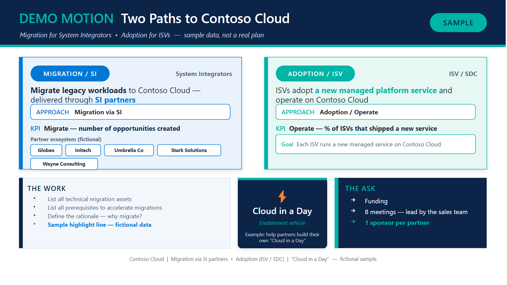

# pptxmotions — a GitHub Copilot CLI skill

Turn a go-to-market **motion** into **one** polished, executive-ready PowerPoint
slide — driven entirely by a small JSON config.

This repo is packaged as a [GitHub Copilot CLI](https://docs.github.com/copilot/how-tos/use-copilot-agents/use-copilot-cli)
**skill**. Once installed, Copilot CLI lists it under `/skills` and uses it
automatically whenever you ask it to summarize a motion onto a slide. The
generator (`motion.js`) is also a standalone Node script, so you can run it
without Copilot.



> The example above uses **fictional sample data** ("Contoso Cloud", made-up
> partners). Replace it with your own content.

---

## Install as a Copilot CLI skill

Copilot CLI loads personal skills from a folder under `~/.copilot/skills/`. Each
skill is its own subfolder containing a `SKILL.md` (with YAML frontmatter). To
install this one, clone the repo into that folder.

### macOS / Linux

```bash
git clone https://github.com/fredgis/pptxskill.git ~/.copilot/skills/pptxmotions
cd ~/.copilot/skills/pptxmotions
npm install            # installs pptxgenjs
```

### Windows (PowerShell)

```powershell
git clone https://github.com/fredgis/pptxskill.git "$env:USERPROFILE\.copilot\skills\pptxmotions"
cd "$env:USERPROFILE\.copilot\skills\pptxmotions"
npm install            # installs pptxgenjs
```

Then **restart Copilot CLI** (or start a new session) and run:

```text
/skills
```

You should see **pptxmotions** in the list. That's it — no extra registration step.

### Use it from Copilot CLI

Just ask, in natural language. Copilot will pick up the skill automatically:

```text
Use the pptxmotions skill to turn this whiteboard photo into one slide:
two paths (SI migration vs ISV adoption), the KPIs shown, partners, and the ask.
```

or point it at a config you wrote:

```text
Build a motion slide from examples/demo-motion.json using pptxmotions.
```

---

## Run it standalone (without Copilot)

```bash
npm install
node motion.js examples/demo-motion.json out.pptx
```

Render to an image for review (requires LibreOffice):

```bash
soffice --headless --convert-to png --outdir out out.pptx
```

---

## Update / uninstall

```bash
# Update to the latest version
cd ~/.copilot/skills/pptxmotions && git pull && npm install

# Uninstall
rm -rf ~/.copilot/skills/pptxmotions
```

On Windows, replace `~/.copilot/...` with `"$env:USERPROFILE\.copilot\..."` and
use `Remove-Item -Recurse -Force` to uninstall.

---

## Config schema

```jsonc
{
  "title": "Deck title (file metadata)",
  "output": "Optional default output filename",
  "footer": "Centered footer line",
  "theme": { "BLUE": "0078D4", "TEAL": "00B4A6" },   // optional palette overrides

  "header": {
    "tag": "DEMO MOTION",              // teal eyebrow before the title
    "title": "Two Paths to Contoso Cloud",
    "subtitle": "Optional italic sub-line",
    "badge": "SAMPLE"                  // optional rounded pill, top-right
  },

  "pathways": [                        // 1 or 2 cards (left = blue, right = teal)
    {
      "tag": "MIGRATION / SI",         // pill label
      "audience": "System Integrators",// right-aligned grey label
      "accent": "0078D4",              // card accent color (optional)
      "headline": [                    // rich text runs
        { "t": "Migrate legacy workloads ", "bold": true },
        { "t": "to Contoso Cloud \u2014 delivered through " },
        { "t": "SI partners", "bold": true, "accent": true }
      ],
      "approach": "Migration via SI",  // chip
      "kpi": "Migrate \u2014 number of opportunities created",
      "bullets": ["Optional bullet", "Another"],           // optional
      "goal": { "label": "Goal", "text": "..." },          // optional box
      "chips": { "label": "Partner ecosystem",             // optional chip row
                 "items": ["Globex", "Initech", "Umbrella Co"] }
    }
  ],

  "bottom": {                          // dark band; each part is optional
    "work": {                          // light panel, left
      "title": "THE WORK",
      "bullets": ["Item", { "text": "Highlighted", "highlight": true }]
    },
    "vehicle": {                       // navy highlight, center
      "icon": "\u26A1", "name": "Cloud in a Day",
      "subtitle": "Enablement vehicle", "note": "Example: ..."
    },
    "ask": {                           // navy panel, right
      "title": "THE ASK",
      "bullets": ["Funding", { "text": "1 sponsor per partner", "highlight": true }]
    }
  }
}
```

### Rich-text run fields (`headline`)

| Field    | Meaning                                             |
| -------- | --------------------------------------------------- |
| `t`      | The text                                            |
| `bold`   | Bold                                                |
| `italic` | Italic                                              |
| `accent` | Color the run with the card's accent color          |
| `color`  | Explicit 6-char hex (no `#`)                        |

### Bullet item shorthand

A bullet can be a plain string or `{ "text": "...", "highlight": true }` to render
it in the accent color and bold (one emphasis line per list works best).

---

## Design system

- 16:9 (13.3" × 7.5"), navy header band + teal rule.
- Two light pathway cards with a colored left accent bar.
- Dark bottom band: `work` (light) + `vehicle` (navy, centered) + `ask` (navy).
- Microsoft Fluent palette, Segoe UI typography. Override colors via `theme`.

## Repo layout

```text
SKILL.md                 # Copilot CLI skill manifest (frontmatter + guidance)
motion.js                # the parametric generator
examples/demo-motion.json# fictional sample config
assets/demo-motion.png   # rendered preview of the sample
README.md  LICENSE  package.json
```

## License

MIT — see [LICENSE](LICENSE). Use it, fork it, get inspired.
